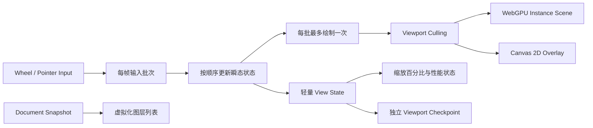

# 大规模图层缩放性能优化实施方案

状态：已实施
适用范围：当前 Next.js + React + Engine Worker + Rust/WASM + WebGPU/Canvas 2D 编辑器
基准规模：50,000 个节点，最大文档上限 100,000 个节点

## 1. 背景

当前大规模文档在连续缩放时出现明显卡顿。现场数据如下：

- 文档节点：约 51,132；
- Worker Render P95：151.3ms，约等于 6–7 FPS；
- Main Thread Long Task：54 次，最差 4,821ms；
- Document：15.3MB；
- WASM Heap：99.1MB；
- Render Surface：39.2MB；
- GPU Scene：135.9MB。

资源尚未超过现有限额，主要问题不是单纯的内存不足，而是一次缩放触发了过多主线程协调、完整文档处理、CPU 场景构建和 GPU 数据上传。

## 2. 目标与非目标

### 2.1 目标

在不改变文档语义、编辑历史、持久化正确性和渲染结果的前提下：

1. 缩放时不再重新处理完整图层列表；
2. 同一输入帧最多执行一次绘制；
3. 只对可见节点执行 Canvas 2D 覆盖层绘制；
4. WebGPU 缩放时只更新相机参数，不重建完整场景顶点；
5. Viewport 持久化不再生成、传输和写入完整 Core Snapshot；
6. 建立可复现的 50K 节点性能基准和回归门槛。

### 2.2 非目标

本方案第一轮不包含：

- 双可见 Canvas 架构；
- 固定网格、R-tree 或 BVH 空间索引；
- 动态 DPR；
- 缩放 LOD；
- Glyph Atlas；
- Rust/wgpu 完整 Render Graph；
- 每个节点的 GPU Buffer 增量更新。

这些能力只有在基础优化完成且指标证明仍有瓶颈时才进入后续阶段。

## 3. 当前瓶颈

### 3.1 图层面板创建和协调全部节点

`src/components/editor/editor-shell.tsx` 当前使用：

```tsx
{[...snapshot.nodes].reverse().map((node) => ...)}
```

50K 文档会创建约 50K 个按钮。每次 `view-state` 更新根 Snapshot 后，React 都需要重新执行这段映射和协调工作。

### 3.2 Viewport 更新经过完整 React Snapshot

Worker 的轻量 `view-state` 到达主线程后会：

1. 构造新的完整 `EditorSnapshot`；
2. 调用 `applyOptimisticUpdates()`；
3. 调用 `setSnapshot()`；
4. 重新执行 EditorShell 及其大规模图层列表。

当存在未确认的 Inspector 修改时，`applyOptimisticUpdates()` 还会对全部节点执行一次或多次 `.map()`。

### 3.3 一批滚轮事件会执行多次绘制

主线程已经按动画帧批量发送输入，但 Worker 会逐个处理批次内的 wheel 事件。每个 wheel 事件都会立即执行 `render()` 和 `emitViewState()`。

### 3.4 Canvas 覆盖层多次扫描完整节点数组

当前一次绘制会分别遍历所有节点以处理：

- Canvas fallback 图元；
- Frame 名称；
- hover；
- selection；
- selection label。

即使绝大多数节点完全位于视口外，仍然会参与这些遍历和部分绘制准备。

### 3.5 WebGPU 每次缩放重建屏幕坐标顶点

当前 GPU 顶点保存屏幕空间位置，导致 viewport 改变时必须：

1. 遍历全部 GPU 可渲染节点；
2. 重新计算所有顶点屏幕坐标；
3. 创建大型 JavaScript 数组；
4. 转换为 `Float32Array`；
5. 重新上传完整 Vertex Buffer。

约 50K 节点时，单帧顶点数据接近 20MB，普通 JavaScript 临时数组还会产生额外 GC 压力。

### 3.6 Viewport checkpoint 重写完整文档

缩放停止 500ms 后，主线程发送 `checkpoint`。Worker 随后执行完整 `emitSnapshot()`，包括：

- `wasmDocument.snapshot_json()`；
- 完整 `nodes`；
- `nodes.map(presentationNode)`；
- 完整 Snapshot 的跨线程结构化克隆。

主线程接收后又会进行 SHA-256、JSON 序列化、OPFS/IndexedDB 写入和读回验证。对于 50K 节点，这会造成明显的缩放结束后尾部卡顿。

## 4. 目标架构



核心原则：

- Canonical Document 仍只由 Rust Core/WASM 管理；
- Engine Worker 仍持有画布、命中测试、视口和每帧渲染；
- React 中的 viewport、selection 和 document 只是 Worker 状态的 UI 投影；
- Viewport 改变不能触发完整文档投影、Snapshot 或持久化；
- GPU 和空间索引都是可重建派生状态，不能进入 Canonical Document。

## 5. 性能基准与测量

### 5.1 50K Fixture

新增确定性性能 Fixture：

- 40,000 个 Rectangle；
- 5,000 个 Ellipse；
- 3,000 个 Text；
- 2,000 个 Frame；
- 使用固定随机种子；
- 节点分布覆盖大世界坐标；
- 常规视口中可见节点控制在 200–1,000 个；
- 同时包含密集重叠区和稀疏区。

性能 Fixture 不进入 Golden 视觉基线，也不通过 50K 次普通 UI Command 创建。它只用于开发和性能测试入口，在完成 hydration 和预热后开始采样。

### 5.2 测试场景

每个场景预热后执行三轮：

1. 100% → 25% → 200% 连续缩放；
2. 连续平移；
3. 缩放过程中选中节点；
4. WebGPU 路径；
5. Canvas 2D fallback；
6. DPR 1 和 DPR 2；
7. 缩放停止后的 viewport checkpoint。

### 5.3 指标

扩展 Worker 性能摘要：

```ts
interface RenderBreakdownSummary {
  samples: number;
  totalP50Ms: number;
  totalP95Ms: number;
  cullingP95Ms: number;
  gpuPrepareP95Ms: number;
  overlayP95Ms: number;
  candidateNodesP95: number;
  visibleNodesP95: number;
  gpuUploadBytesP95: number;
  rendersPerInputFrameMax: number;
}
```

主线程同时记录：

- 动画帧间隔 P50/P95；
- Long Task 数量和最大值；
- 输入批次积压时间；
- Viewport checkpoint 总耗时；
- 图层列表实际 DOM 行数。

指标在 Worker 内聚合，每 250ms 或手势结束后发送一次。禁止每帧排序和传输完整样本数组。

### 5.4 验收门槛

| 指标 | 第一阶段 | 最终目标 |
| --- | ---: | ---: |
| Main Thread Long Task | 最大 <50ms | 0 个 |
| Frame Interval P95 | <33.3ms | <20ms |
| Worker CPU Render P95 | <25ms | <12ms |
| 输入积压 P95 | <50ms | <32ms |
| 图层列表 DOM 行数 | <150 | <150 |
| 每输入帧绘制次数 | ≤1 | ≤1 |
| Viewport checkpoint | <20ms | <10ms |
| 缩放帧 GPU 上传 | 仅候选场景 | Camera Uniform ≤256B |

Worker `render()` 时间只代表 CPU 提交时间，不能单独作为 60 FPS 证据。实际验收必须同时观察动画帧间隔和输入积压。`queue.onSubmittedWorkDone()` 只允许低频抽样 GPU backlog，不能每帧等待。

## 6. 实施阶段

## 6.1 阶段 A：主线程与持久化路径

### A1. 图层列表虚拟化

新增：

- `src/components/editor/layer-panel.tsx`；
- `src/components/editor/virtual-layer-list.tsx`；
- `src/lib/virtual-range.ts`；
- `src/lib/virtual-range.test.ts`。

图层行高当前固定为 31px，采用固定行高虚拟化，不新增第三方 UI 依赖：

```ts
const ROW_HEIGHT = 31;
const OVERSCAN = 8;

const start = Math.max(0, Math.floor(scrollTop / ROW_HEIGHT) - OVERSCAN);
const end = Math.min(
  nodeCount,
  Math.ceil((scrollTop + viewportHeight) / ROW_HEIGHT) + OVERSCAN,
);
```

实现要求：

- 不再执行 `[...nodes].reverse()`；
- 使用 `nodes.length - 1 - virtualIndex` 读取反向图层；
- LayerPanel 使用 `React.memo`；
- 选中节点时自动滚动到对应行；
- 每行保留 button 语义；
- 添加 `aria-setsize` 和 `aria-posinset`；
- DOM 行数包含 overscan 后仍不得超过 150。

### A2. 拆分 UI 投影状态

把当前单一 React Snapshot 投影拆成：

```ts
type DocumentUiState = Pick<
  EditorSnapshot,
  "revision" | "nodes" | "canUndo" | "canRedo" | "resources" | "renderer" | "gpu" | "documentCore"
>;

type SelectionUiState = {
  selectedIds: string[];
};

type ViewUiState = {
  viewport: Viewport;
  performance?: RenderPerformanceSummary;
};
```

处理规则：

- `snapshot` 更新 Document、Selection 和 View；
- `view-state` 只更新 View；
- selection 变化才更新 Selection；
- `view-state` 不调用 `applyOptimisticUpdates()`；
- 乐观投影只在 Inspector 输入、完整 Snapshot 和 command ack 时执行；
- `nodes` 未变化时保持引用稳定；
- Viewport checkpoint 仍使用 Worker 确认过的 viewport，不使用未确认的本地猜测值。

保留现有 `confirmedSnapshotRef`、`snapshotRef`、恢复和事务队列语义，避免形成第二套可写文档模型。

### A3. 轻量 Viewport checkpoint

协议新增：

```ts
type ViewportCheckpointMessage = {
  type: "viewport-checkpoint";
  viewport: Viewport;
  documentHash: string;
  coreRevision: number;
};
```

存储新增独立记录：

```ts
type ViewportRecord = {
  format: "viewport-record-v1";
  viewport: Viewport;
  documentHash: string;
  coreRevision: number;
};
```

规则：

- 缩放或平移停止 500ms 后只写 ViewportRecord；
- 不调用 `wasmDocument.snapshot_json()`；
- 不发送完整 `nodes`；
- 不生成新的不可变 Core Snapshot；
- 文档发生正式编辑时仍按现有 Journal + Snapshot 流程持久化；
- 恢复时先加载 Core Snapshot，再加载与当前文档匹配的 ViewportRecord；
- documentHash 不匹配时忽略旧 ViewportRecord；
- viewport 写入失败不影响文档编辑和文档持久化。

该改动需要同步更新 `docs/adr/0001-editor-boundaries.md`。

### A4. 阶段 A 验收

- 50K 图层面板 DOM 行数小于 150；
- 连续缩放不触发 LayerPanel React commit；
- 连续缩放不执行全量 optimistic projection；
- 缩放停止后不发送完整 EditorSnapshot；
- viewport 刷新后可以正确恢复；
- 文档 Snapshot 损坏回退、Journal replay 和多标签页 Owner 语义保持不变。

## 6.2 阶段 B：输入批处理与视口裁剪

### B1. 每批输入最多绘制一次

把 wheel 处理拆成只更新状态的函数：

```ts
function applyWheel(event: WheelInput): void {
  // 按当前算法顺序更新 viewport，不执行 render 或 emit。
}
```

纯 wheel 批次处理方式：

```ts
for (const event of events) applyWheel(event);
render();
emitViewState(true);
```

约束：

- 所有 wheel 事件仍按原始顺序执行；
- 不直接累加 delta 后只计算一次，因为当前缩放算法依赖事件数量和 delta 正负；
- Pointer Down/Up/Leave 顺序保持不变；
- Down/Up/Leave 之前必须保留最后一个 Pointer Move；
- 混合批次遇到语义边界时允许 flush；
- 纯滚轮输入同一批次只能绘制一次。

测试至少覆盖：

- 10 个 wheel 事件只产生一次 render；
- 最终 viewport 与逐个执行完全相同；
- pointer 与 wheel 混合时顺序不变；
- up/leave 不丢失最后一个 move；
- 每帧最多发送一次 view-state。

### B2. 线性视口裁剪

新增：

- `src/lib/scene-visibility.ts`；
- `src/lib/scene-visibility.test.ts`。

接口：

```ts
function viewportWorldBounds(
  viewport: Viewport,
  width: number,
  height: number,
  overscanPx?: number,
): Bounds;

function collectVisibleNodes(
  nodes: readonly CanvasNode[],
  viewportBounds: Bounds,
): CanvasNode[];
```

实现要求：

- 使用旋转后的世界包围盒；
- 默认增加约 100px overscan；
- 保持原始 z-order；
- 不改变 locked、hidden、opacity 和选择语义；
- Canvas fallback 和 Frame 标签都只能遍历候选节点；
- 视口外的 selected/hovered 节点可以参与状态计算，但不应产生不可见绘制。

第一版使用 O(N) 线性 AABB 检查。只有当 50K 基准中的 culling P95 超过 2ms，才立项评估空间索引。

### B3. Overlay 按 ID 访问

Worker 维护可重建索引：

```ts
const nodeById = new Map<string, CanvasNode>();
```

绘制结构调整为：

```ts
renderGpuScene(visibleGpuNodes);
renderCanvasFallback(visibleFallbackNodes);
renderTextOverlay(visibleTextNodes);
renderFrameLabels(visibleFrames);
renderHover(nodeById.get(hoveredId));
renderSelections(selectedIds.map((id) => nodeById.get(id)));
renderSelectionLabel(selectedNodes);
renderMarquee();
renderGrid();
```

`nodeById` 在 hydrate、undo、redo 时完整重建，在 create/update/delete 时与 Worker 投影同步更新。它只属于派生状态，不能被持久化。

### B4. 阶段 B 验收

- 纯 wheel 批次 render 次数为 1；
- Candidate Nodes 与实际画面一致；
- 旋转节点在视口边缘不闪烁；
- z-order 不变；
- selection、hover 和 Frame label 行为不变；
- Canvas 2D fallback P95 明显低于优化前；
- culling P95 小于 2ms，或形成独立空间索引决策记录。

## 6.3 阶段 C：WebGPU 世界坐标实例化

### C1. 固定几何和 Instance Buffer

使用一个永久单位 Quad：

```ts
const UNIT_QUAD = [
  0, 0,
  1, 0,
  0, 1,
  0, 1,
  1, 0,
  1, 1,
];
```

每个节点只保存实例数据：

```ts
interface GpuNodeInstance {
  position: [number, number];
  size: [number, number];
  rotation: number;
  radius: number;
  strokeWidth: number;
  kind: number;
  fill: [number, number, number, number];
  stroke: [number, number, number, number];
}
```

通过实例化绘制：

```ts
pass.draw(6, instanceCount);
```

实例数据保存世界坐标，Vertex Shader 负责节点旋转、相机变换和 NDC 转换。

### C2. Camera Uniform

```ts
interface CameraUniform {
  viewportX: number;
  viewportY: number;
  zoom: number;
  canvasWidth: number;
  canvasHeight: number;
  dpr: number;
}
```

Viewport 改变时只更新 Camera Uniform。Document revision、Renderer generation 或颜色配置改变时才重建 Instance Buffer。

第一版缓存失效规则：

```text
sceneKey = documentRevision + rendererGeneration + colorProfile
cameraKey = viewport + canvasSize + dpr
```

规则：

- hydrate、undo、redo：完整重建 Instance Buffer；
- create/update/delete：第一版允许完整重建；
- viewport change：只更新 Camera Uniform；
- resize：更新 surface 和 Camera Uniform；
- device lost：递增 rendererGeneration 并完整重建；
- GPU 资源淘汰不得影响文档语义。

Dirty Node 增量更新不属于本阶段。后续只有在协议能够可靠提供 dirtyNodeIds 和完整失效键后才实施。

### C3. 保留当前合成边界

本阶段继续使用辅助 WebGPU OffscreenCanvas + ImageBitmap + 主 Canvas 2D Overlay。

新增分项测量：

- Instance Buffer rebuild；
- Camera Uniform upload；
- `transferToImageBitmap()`；
- `drawImage()`；
- Canvas overlay。

只有当 ImageBitmap 合成路径在阶段 C 完成后仍稳定占用帧预算 20% 以上，才创建双 Canvas ADR 和独立实施方案。

### C4. 阶段 C 验收

- 单纯缩放不重建 Instance Buffer；
- 单纯缩放 GPU 上传不超过 Camera Uniform 大小；
- Device Lost 后场景可以完整恢复；
- GPU 资源预算仍在限制内；
- WebGPU 与 Canvas fallback 的基础图元结果通过现有 Golden；
- Frame Interval P95 达到最终门槛，或输出剩余瓶颈分项数据。

## 7. 后续条件性优化

### 7.1 空间索引

触发条件：线性 culling P95 在目标设备上稳定超过 2ms。

立项时比较：

1. Rust Core/Scene 内 R-tree 或 BVH；
2. Worker 内 packed R-tree；
3. Worker 内固定网格。

评估维度包括更新成本、超大节点、旋转包围盒、z-order 恢复、WASM 边界成本和内存预算。未评估前不预先指定实现。

### 7.2 Dirty Node GPU 更新

触发条件：文档编辑造成的完整 Instance Buffer rebuild 超过交互预算。

前置条件：

- 事务结果包含 dirtyNodeIds；
- Undo/Redo/Hydrate 可以显式声明 full invalidation；
- 缓存键覆盖 geometry、style、clip、font、asset、zoom bucket 和 color profile；
- slot 回收和 z-order 更新有独立测试。

### 7.3 双 Canvas

触发条件：ImageBitmap 合成稳定占用帧预算 20% 以上。

需要单独处理：

- Worker init 协议；
- Canvas recovery；
- ResizeObserver；
- Pointer Capture；
- Golden capture 的目标 Canvas；
- WebGPU Device Lost；
- Canvas 2D fallback；
- ADR 0001 更新。

### 7.4 动态 DPR 与 LOD

触发条件：基础架构优化后仍无法满足低端设备目标。

必须独立定义 zoom bucket、滞回区间和高清补绘，并通过像素 Golden 验证。不得在基础性能提交中改变渲染语义。

## 8. 文件改动清单

| 文件 | 计划改动 |
| --- | --- |
| `src/components/editor/editor-shell.tsx` | 拆分 Document、Selection、View UI 投影 |
| `src/components/editor/layer-panel.tsx` | 独立且 memo 化的图层面板 |
| `src/components/editor/virtual-layer-list.tsx` | 固定行高虚拟列表 |
| `src/lib/virtual-range.ts` | 虚拟行范围计算 |
| `src/lib/editor-protocol.ts` | 轻量 viewport checkpoint 与性能摘要协议 |
| `src/lib/optimistic-projection.ts` | 保持只处理文档事件，不进入高频 view-state 路径 |
| `src/lib/local-document.ts` | 独立保存和恢复 ViewportRecord |
| `src/lib/input-transfer-batcher.ts` | 输入批次统计与批次边界测试 |
| `src/lib/render-quality.ts` | 动态 DPR 桶、滞回和静止高清补绘策略 |
| `src/lib/viewport-checkpoint-performance.ts` | 独立 viewport 写入耗时的有界证据 |
| `src/workers/editor.worker.ts` | 单批一次绘制、裁剪、按 ID Overlay、轻量 checkpoint |
| `src/lib/scene-visibility.ts` | Viewport bounds 和线性可见性查询 |
| `src/lib/webgpu-scene.ts` | Instance Buffer、Camera Uniform、缓存失效 |
| `src/lib/performance-sampling.ts` | 分项指标和低频摘要 |
| `src/app/globals.css` | 虚拟列表样式 |
| `scripts/capture-phase0-evidence.sh` | 增加真实缩放性能场景 |
| `docs/adr/0001-editor-boundaries.md` | 记录独立 ViewportRecord 持久化语义 |

所有新增模块必须包含对应单元测试。涉及 Worker 协议、存储 Schema、GPU Device Lost 和恢复路径的改动还必须增加集成测试。

## 9. 提交与回滚边界

按以下顺序拆分提交，每个提交都必须单独通过测试和性能采集：

1. 50K Fixture、真实缩放基准和分项指标；
2. 图层列表虚拟化；
3. View UI 状态拆分，view-state 绕过乐观文档投影；
4. 独立 ViewportRecord 和轻量 checkpoint；
5. 纯 wheel 批次一次绘制；
6. 线性视口裁剪和按 ID Overlay；
7. WebGPU world-space instance buffer；
8. Camera Uniform 和场景缓存失效；
9. 根据数据决定是否立项空间索引、双 Canvas 或 LOD。

每一步都保留 Canvas 2D fallback。任何阶段出现视觉差异、输入顺序错误、Snapshot 恢复失败或 Device Lost 无法恢复时，应回滚该阶段，不得通过降低正确性要求换取性能数据。

## 10. 测试矩阵

### 10.1 单元测试

- 虚拟列表 start/end/overscan；
- 反向图层索引；
- 选中图层滚动定位；
- ViewportRecord hash/revision 匹配；
- viewport 保存失败不影响文档；
- wheel 批次顺序和最终 viewport；
- 一批输入最多一次 render；
- 旋转 AABB 与视口相交；
- 可见节点 z-order；
- selection/hover 按 ID 查询；
- Camera 变化不重建 Instance Buffer；
- document revision 变化会重建 Instance Buffer；
- Device Lost 会使全部 GPU 缓存失效。

### 10.2 集成测试

- 50K 文档加载后连续缩放；
- 缩放同时选择节点；
- 缩放结束后刷新，viewport 正确恢复；
- checkpoint 与文档编辑并发时不覆盖较新 Snapshot；
- Owner/只读标签页行为不变；
- Worker crash 后从 Snapshot + Journal 恢复；
- WebGPU Device Lost 后恢复或进入 Canvas fallback；
- DPR 1/2；
- WebGPU 可用/不可用；
- Canvas 2D 固定 Fixture Golden 不变。

### 10.3 性能回归测试

性能测试不能只判断平均值。每项至少运行三轮并记录中位 P50/P95/Max。CI 或正式验收环境必须固定：

- 浏览器版本；
- 操作系统；
- 视口尺寸；
- DPR；
- Renderer；
- Fixture hash；
- WASM hash；
- 预热时长。

## 11. 完成定义

本方案完成需要同时满足：

1. 阶段 A、B、C 的功能与测试全部通过；
2. 50K 连续缩放达到最终验收门槛；
3. 缩放期间没有完整 Document Snapshot 或持久化写入；
4. 缩放停止后的 ViewportRecord 写入小于 10ms；
5. 缩放帧只更新 Camera Uniform，不重建 GPU 场景；
6. 图层列表 DOM 行数始终小于 150；
7. Canvas 2D fallback、Worker recovery、Device Lost、Journal 和多标签页语义没有回归；
8. Golden 和兼容性检查通过；
9. 剩余条件性优化均有测量数据支持，不作为无依据的预先实现。
