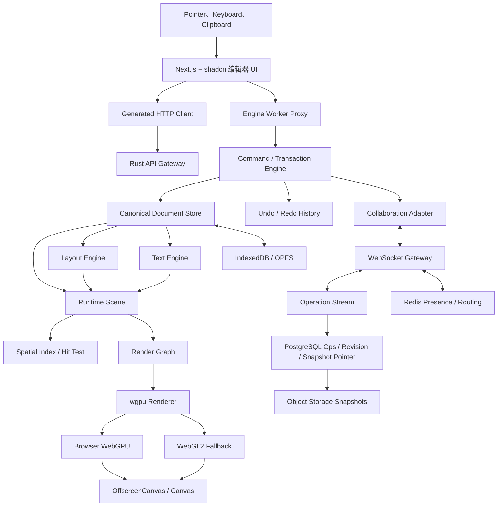
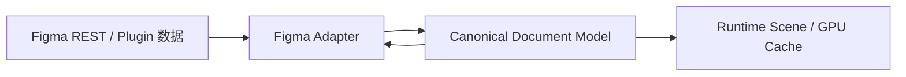
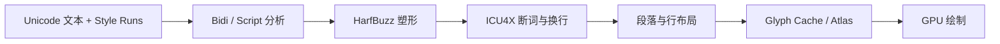
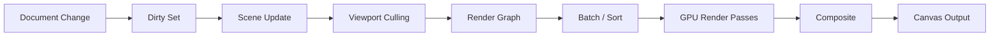
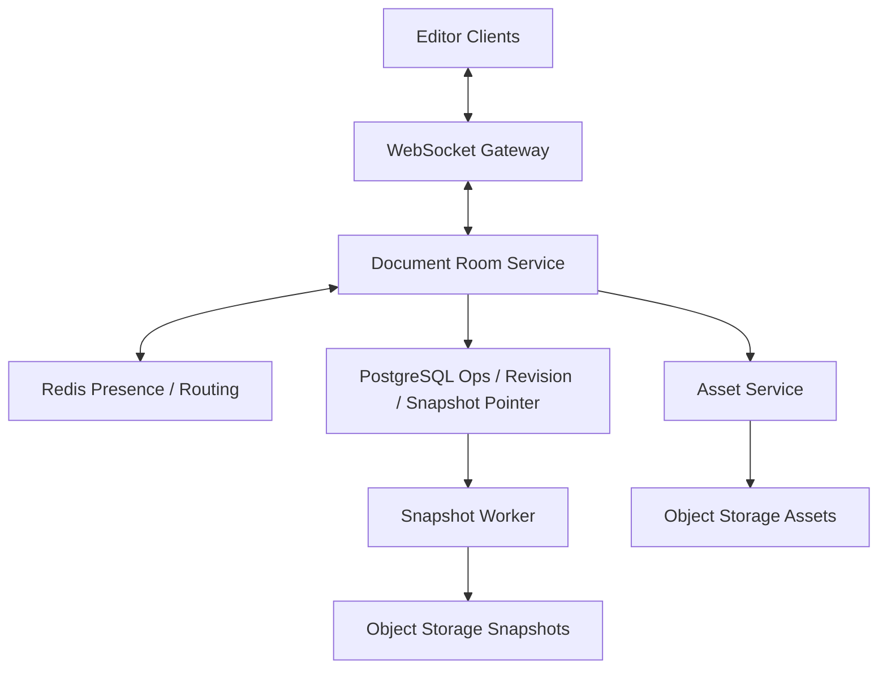

# 类 Figma Canvas 设计工具技术架构方案

> 长期技术路线：Rust + WebAssembly + WebGPU  
> 文档版本：v1.3  
> 更新日期：2026-08-03  
> 适用范围：浏览器端优先、支持桌面客户端、多人实时协同的专业级 2D UI 设计工具

---

## 1. 文档目的

本文用于指导一款类 Figma Canvas 设计工具的技术立项、架构设计和阶段实施。产品目标是逐步覆盖以下核心能力：

- 无限画布、缩放、平移和多层级图形编辑；
- Rectangle、Ellipse、Frame、Group、Vector、Boolean、Text 等节点；
- 与 Figma 接近的 Fill、Stroke、Effect、Blend Mode、Mask 数据结构；
- Constraints、Auto Layout、Components、Variants、Instances 和 Variables；
- 精确的文本排版、字体管理和导出；
- Undo/Redo、自动保存、版本历史；
- 多人实时协同、Presence、评论和权限；
- Figma REST JSON 导入，以及通过 Figma Plugin 写回 Figma；
- 浏览器、桌面客户端和服务端渲染共享核心能力。

本文关注长期可演进架构，不以短期 Demo 框架为最终技术边界。

### 1.1 首版明确非目标

- 不生成或修改 Figma 私有 `.fig` 二进制文件；
- 不承诺首版覆盖 Figma 的全部节点、原型、Dev Mode 和插件生态；
- 不支持移动端完整编辑器，移动端只考虑查看和评论；
- 不支持跨地域 active-active 的同一文档写入；
- 不允许文档或插件直接执行任意 WGSL/GLSL；
- 不承诺直接运行 Figma Plugin，插件 API 只做概念兼容和迁移辅助；
- 不把 WebGL2 降级模式定义为所有 WebGPU 高级效果的像素级等价实现。

任何非目标进入当前阶段都必须通过范围变更评审，并同步调整兼容矩阵、人员、风险和验收 Gate。

---

## 2. 核心结论

推荐采用以下主技术栈：

| 领域 | 推荐技术 |
|---|---|
| 编辑器界面 | Next.js App Router、TypeScript strict、React、Tailwind CSS、shadcn Base UI |
| 图形与文档核心 | Rust |
| 浏览器运行时 | WebAssembly |
| GPU 渲染 | WebGPU，WebGL2 兼容后端 |
| Shader | WGSL，必要时生成兼容 GLSL |
| 并行执行 | 单一 Engine Worker + OffscreenCanvas；SharedArrayBuffer 为可选优化 |
| 几何计算 | Rust 自研模块，结合 lyon、kurbo、Clipper2 等库评估 |
| 文本塑形 | HarfBuzz |
| Unicode 与断行 | ICU4X；Phase 0 不能满足语种基线时才通过 ADR 切换 ICU4C |
| 字体解析与栅格化 | FreeType + 自有 Glyph Cache/Atlas |
| UI 临时状态 | Zustand |
| 文档编辑状态 | Rust Document Store + Command/Event 系统 |
| 协同编辑 | 版本化 Operation Envelope；Yjs/Yrs 仅作为文本 CRDT 候选实现 |
| 实时通信 | WebSocket |
| 后端 | Rust + Axum/Tokio；非核心离线数据任务可独立选型 |
| 数据存储 | PostgreSQL、Redis、S3/R2/OSS |
| 本地持久化 | IndexedDB、OPFS |
| 内部序列化 | Protobuf 二进制；Snapshot 按 Page/资源索引分块 |
| 外部交换格式 | 版本化 JSON、Figma REST Schema Adapter |
| 桌面端 | Electron，确保 Chromium/WebGPU 行为与 Web 端一致 |
| 测试 | Rust tests、Vitest、Playwright、像素基准测试、协同收敛测试 |

React 只负责菜单、工具栏、属性面板、图层面板和弹窗。画布场景、命中测试、布局计算和逐帧渲染不由 React DOM 承担。

前端与后端独立构建、独立部署和独立版本管理。Next.js 不承载文档、协同、资源或权限业务后端；所有业务能力通过版本化 HTTP/WebSocket/Protobuf 契约访问 Rust 服务。

---

## 3. 设计原则

### 3.1 文档模型是唯一事实来源

节点属性、层级关系、样式引用、组件实例覆盖和变量绑定都存储在 Canonical Document Model 中。GPU Buffer、绝对包围盒、空间索引和缓存纹理属于派生数据，不写入文档。

### 3.2 所有变更必须经过命令系统

UI、快捷键、插件、导入器和协同消息不能直接修改节点。所有修改统一转换为 Command，由同一套事务、历史、权限和协同逻辑处理。

### 3.3 文档、布局、渲染相互解耦

- Document Core 管理语义数据；
- Layout Engine 计算尺寸和位置；
- Scene Engine 生成运行时场景；
- Renderer 负责可见结果；
- UI 仅提交意图并展示结果。

### 3.4 渲染后端可替换

上层不直接依赖 WebGPU API，通过 Rust 中的 `GraphicsBackend` 抽象访问纹理、Buffer、Render Pass 和 Shader Pipeline。首要后端为 WebGPU，并保留 WebGL2 降级能力。

### 3.5 兼容 Figma 语义，不绑定私有文件格式

内部数据模型尽可能对齐 Figma 公开的 Node、Paint、Effect、TextStyle、Auto Layout、Components 和 Variables 语义，但不把 Figma REST JSON 直接作为运行时数据库格式。

---

## 4. 总体架构



### 4.1 线程划分

默认只使用两个执行上下文：

| 执行位置 | 唯一所有权 |
|---|---|
| Main Thread | React UI、输入采集、无障碍 DOM、系统菜单、剪贴板和 Worker Proxy |
| Engine Worker | Rust/WASM Document、Command、Layout、Text、Scene、Hit Test、OffscreenCanvas、wgpu 和全部 GPU 资源 |

Document 与 Renderer 放在同一个 Engine Worker，避免为每一帧跨 Worker 序列化 Render Command，也避免 GPU 资源所有权分散。只有性能数据证明文本塑形、图片解码或导出阻塞交互时，才把这些无状态或任务型工作拆到 Auxiliary Worker；Document 和 GPU Device 仍保持单一所有者。

Pointer Move 使用合并后的最新事件，不为每个事件等待 Promise。普通环境通过 Transferable ArrayBuffer 批量传输；只有 crossOriginIsolated 为 true 且部署已满足 COOP、COEP、CDN、字体和插件资源约束时才启用 SharedArrayBuffer。无 SharedArrayBuffer 时功能必须完整。

---

## 5. 前端编辑器层

### 5.0 强制技术约束

- 只使用 Next.js App Router，不使用 Pages Router；
- TypeScript 开启 strict，不允许以 any 绕过协议和组件类型；
- shadcn 初始化固定使用 Base UI 基座，官方 CLI 参数为 --base base；
- 所有通用 UI Primitive 从 shadcn 安装到本地 components/ui；
- 业务组件只能组合 shadcn Primitive，不引入第二套组件库；
- 禁止在业务代码中直接导入 @base-ui/react、Radix、MUI、Ant Design、Chakra 或同类组件库；
- Base UI 的直接依赖只允许存在于 shadcn 生成或维护的 components/ui 内部；
- Canvas、WebGPU、图形控制点和高性能 Overlay 属于编辑器渲染内核，不被当作 DOM 组件库替代物；
- 使用 Function Component + Hooks，不使用 Class Component；
- 页面文件保持薄，只负责路由、权限壳、加载边界和 Feature Composition。

项目初始化基线：

```bash
pnpm dlx shadcn@latest init --template next --base base --css-variables
```

components.json、生成的 components/ui 源码、package.json 和 lockfile 必须提交版本库。shadcn 组件更新通过独立 PR 执行 shadcn diff/覆盖检查，并运行视觉回归，禁止在日常功能提交中无记录地覆盖本地组件修改。

components.json 至少固定 `rsc: true`、`tsx: true`、CSS Variables 和 `@/components`、`@/components/ui`、`@/hooks`、`@/lib`、`@/lib/utils` 别名。Base UI 基座不能只靠人工阅读配置判断：初始化后保存 `shadcn info --json` 基线，并检查生成组件的依赖，确认没有混入 Radix 或 React Aria 版本。视觉 Style、Icon Library、Base Color 一经在 Phase 0 选定即冻结；变更必须经过 ADR、全量视觉回归和键盘回归。

命令中的 @latest 只用于首次选择当前官方脚手架；初始化完成后记录实际 shadcn CLI、Next.js、React、Base UI 和 Tailwind 版本并由 lockfile 固定。CI 与生产构建不得联网执行 @latest，也不得在安装阶段重新生成 components/ui。

### 5.1 React 负责的范围

- 顶部工具栏；
- 左侧图层树和资源面板；
- 右侧属性面板；
- 菜单、弹窗、Context Menu；
- 评论、协作成员和文件状态；
- 插件 UI 容器；
- 无障碍语义和键盘导航。

### 5.2 React 不负责的范围

- 每个图层的 DOM 节点；
- 图形路径渲染；
- 逐帧拖动结果；
- 场景树遍历；
- Auto Layout 计算；
- 精确文本测量；
- GPU 资源生命周期。

### 5.3 状态划分

UI Store 只保存短生命周期界面状态：

```ts
interface EditorUiState {
  activeTool: ToolKind
  openPanels: string[]
  hoveredNodeId?: string
  contextMenu?: ContextMenuState
  propertyDraft?: PropertyDraft
}
```

Viewport 和 Selection 可以在 TypeScript 中保留只读镜像，但最终状态以 Rust Editor Core 为准。Core 推送带单调递增 uiRevision 的 UI Snapshot，Main Thread 丢弃旧 revision；属性输入草稿只在 UI 暂存，提交时必须携带其读取的 documentRevision，避免过期面板覆盖新状态。

### 5.4 可访问性边界

Canvas 像素本身不提供可访问语义，因此 Main Thread 必须维护由 Core Snapshot 驱动的虚拟可访问树，而不是让辅助技术读取 GPU 场景：

- 工具、属性面板和图层树完整支持键盘与焦点顺序；
- 选中节点、位置、尺寸、锁定、隐藏和编辑结果通过 ARIA live region 适度播报；
- 图层树提供与画布选择等价的可访问操作入口；
- 快捷键允许查看和重映射，不能只有鼠标手势；
- 支持高对比度、Reduced Motion 和不依赖颜色的状态表达；
- 可访问树使用 uiRevision 防止播报过期状态，不能复制整棵 10 万节点场景到 DOM。

### 5.5 Hooks + Components 组织规范

前端采用 Feature-first 的 Hooks + Components 结构：

```text
src/
├── app/                         # Next.js App Router，页面和 Layout 保持薄
├── components/
│   ├── ui/                      # shadcn Base UI 源码，通用 Primitive
│   └── editor/                  # 跨 Feature 的编辑器组合组件
├── features/
│   ├── canvas/
│   │   ├── components/
│   │   ├── hooks/
│   │   ├── model/
│   │   └── index.ts
│   ├── inspector/
│   ├── layers/
│   ├── assets/
│   └── collaboration/
├── hooks/                       # 真正跨 Feature 的通用 Hook
├── lib/
│   ├── api/                     # 生成的 HTTP Client 与错误映射
│   ├── protocol/                # Protobuf/Presence 生成类型
│   ├── editor-worker/           # Worker Proxy
│   └── utils/
├── stores/                      # Zustand，仅保存 UI 临时状态
└── styles/
```

职责规则：

- Components 负责展示、组合和派发用户意图，不直接访问数据库、WebSocket、WASM 内存或全局浏览器单例；
- Hooks 负责生命周期、订阅、Command 调度、快捷键、Worker/API 适配和可复用交互状态；
- Hook 不返回不稳定的大对象，每帧数据使用订阅或 ref，避免高频 React 重渲染；
- Feature 内部模块默认私有，只通过 index.ts 暴露稳定 API；
- components/ui 只放 shadcn Primitive，不放业务状态和编辑器领域逻辑；
- components/editor 和 features/*/components 必须由 shadcn Primitive 组合；
- 不创建无业务边界的巨型 useEditor Hook；按 viewport、selection、commands、presence、inspector 等职责拆分；
- Event Listener、Worker Subscription 和快捷键必须在 Hook cleanup 中释放；
- 所有异步 Hook 处理 AbortSignal、过期请求和组件卸载，不能用布尔变量掩盖竞态。

### 5.6 Next.js Server/Client Component 边界

- Root Layout、Metadata、登录外壳和静态页面优先使用 Server Component；
- Editor Workspace 是明确的 Client Component Boundary，因为需要 Worker、OffscreenCanvas、WebGPU、Pointer 和 Clipboard；
- 只有需要浏览器 API、Hook 或交互状态的文件添加 use client，禁止在 app 顶层无差别 Client 化；
- Server Component 不直接调用 Document/Collaboration 内部服务；需要用户会话信息时只调用公开 Backend API；
- 不在 Next.js Route Handler、Server Action 或 Middleware 中实现文档写入、Operation 合并、资源处理和权限业务；
- Editor 首屏通过轻量 Shell、Skeleton 和动态加载启动，不把 WASM、字体和完整 shadcn 面板打入公共营销页面 Bundle；
- Next.js Cache、Server Action 和 RSC Payload 不作为编辑文档状态或协同状态的事实来源。

---

## 6. Rust/WASM 编辑器核心

以下首先是逻辑模块边界。第一阶段只建立少量稳定 crates，避免过早拆出十多个相互循环依赖的小包：

```text
crates/
├── editor-core          # document、command、history、layout、scene、spatial
├── graphics-core        # geometry、text、render graph、CPU 资源
├── renderer-wgpu        # WebGPU/WebGL2、GPU 资源和恢复
├── protocol             # Protobuf、Operation、Snapshot、Presence
├── figma-adapter        # Figma REST/Plugin 数据映射
└── editor-wasm          # wasm-bindgen 与 Engine Worker 接口
```

### 6.1 WASM 与 Worker 边界设计

Main Thread 面向的是异步 Worker Proxy，WASM 同步函数只在 Engine Worker 内调用。两层接口不能混为一个 API：

```ts
interface EditorWorkerProxy {
  dispatch(commandBatch: Uint8Array): Promise<DispatchAck>
  setViewport(viewport: Viewport): void
  pushPointerBatch(events: Uint8Array): void
  subscribeUiSnapshot(listener: (snapshot: UiSnapshot) => void): Unsubscribe
  exportDocument(format: ExportFormat): Promise<Uint8Array>
}
```

避免让 JavaScript 高频调用大量细粒度 getter，例如逐节点调用 `getX()`、`getY()`、`getFill()`。属性面板使用 Core 主动推送的聚合 Inspector Snapshot。Command Ack 至少包含 transactionId、acceptedRevision、result 和结构化错误；高频 Pointer 事件不逐个返回 Ack。

### 6.2 运行时内存与失败边界

WASM、CPU 资源、GPU 资源和浏览器资源分别记账，不能只观察浏览器总内存：

| 资源池 | 初始预算与策略 |
|---|---|
| WASM Heap | B1 的 10 万基础节点 Fixture 目标小于 256 MB；超过软限制触发诊断 |
| CPU 图片/字体 | 解码后按 LRU 淘汰；原始资源由 OPFS/HTTP Cache 持有 |
| GPU Texture/Buffer | B1 目标小于 512 MB；按可见性、最近使用和重建成本淘汰 |
| Undo/Operation | 按操作数和字节双重限制；超限前生成 Snapshot 并压缩历史 |

任何单次导入、图片解码、字体解析、模糊离屏纹理或导出任务都必须有尺寸上限、取消信号和错误返回。OOM、Worker Panic 或 GPU Device Lost 不能修改 Canonical Document；恢复时从最近已确认 revision 重建派生状态。内存预算属于 Phase 0 Fixture 的验收项，目标设备变更时必须重新标定。

### 6.3 错误模型与崩溃恢复

跨 Rust、WASM、Worker 和服务端使用稳定错误分类：INVALID_COMMAND、REVISION_CONFLICT、AUTHZ_DENIED、RESOURCE_LIMIT、UNSUPPORTED_FEATURE、CORRUPT_DATA、TRANSIENT、INTERNAL。错误响应包含 errorCode、safeMessage、retryable、transactionId、documentRevision 和 diagnosticId；内部堆栈、文件路径、Token 和私有文档数据不得返回 UI。

业务校验失败使用 Result，不使用 panic。Worker 顶层捕获不可恢复错误，停止接受新 Command，先确认 pending journal 已落盘，再由 Main Thread 重启 Worker 并从 Snapshot + Journal 恢复。相同 Build 在同一 Fixture 上连续崩溃达到阈值后进入 Safe Mode，关闭 WebGPU 高级效果和插件，并允许用户下载诊断包与文档副本。

---

## 7. 文档数据模型

### 7.1 节点树

文档结构采用稳定 ID 和父子关系：

```text
Document
└── Page
    ├── Section
    ├── Frame
    │   ├── Rectangle
    │   ├── Text
    │   └── Instance
    ├── Component
    └── ComponentSet
```

推荐在内存中使用规范化存储：

```rust
struct DocumentStore {
    document_id: NodeId,
    nodes: SlotMap<NodeKey, Node>,
    id_index: HashMap<NodeId, NodeKey>,
    styles: HashMap<StyleId, Style>,
    variables: HashMap<VariableId, Variable>,
    collections: HashMap<CollectionId, VariableCollection>,
    revision: u64,
}
```

NodeId、StyleId、VariableId、AssetId、OperationId 和 TransactionId 统一使用由密码学安全随机源生成的 128-bit ID；排序和冲突处理不得依赖 ID 的字典序或生成时间。测试通过注入确定性 ID Generator 保持可复现。节点通过稳定 `NodeId` 对外引用，通过紧凑 `NodeKey` 在进程内访问。NodeKey 只在当前进程有效，禁止进入 Snapshot、Operation、日志和 UI API。

规范化文档不同时持久化 parent.children 和 child.parent_id 两套事实来源。每个非根节点保存唯一 parent_id 与稳定 position_id，运行时按 parent_id 分组、按 position_id 排序生成 Children Cache：

```rust
struct TreeLocation {
    parent_id: NodeId,
    position_id: PositionId,
}
```

PositionId 必须支持并发插入、跨父级移动和确定性比较，不能使用数组下标或浮点数作为长期顺序键。移动节点时，parent_id 与 position_id 在同一 Transaction 中原子更新。

Document Reducer 每次提交后校验以下不变量：

- 每个非根节点恰好有一个有效父节点；
- Document 只能包含 Page，Page 不能成为 SceneNode 的子节点；
- 节点关系无环，不能把节点移动到自身后代；
- 同一父节点下 PositionId 唯一且可确定排序；
- Style、Variable、Component 和 Asset 引用必须存在或显式标记为 unresolved；
- NodeId、StyleId、VariableId 和 AssetId 在文档生命周期内不复用；
- Snapshot 不包含 Bounds、GPU Handle、Children Cache 等派生数据。

### 7.2 节点类型与阶段

节点类型必须与实施路线一致，不能在 Schema 中声明“已支持”但没有对应编辑、渲染、保存和验收能力：

| 阶段 | 节点类型 |
|---|---|
| Phase 0 | Frame、Rectangle、Ellipse、Text 的基础单机投影 |
| Phase 1 | Document、Page，以及 Frame、Rectangle、Ellipse、Text 的稳定层级语义 |
| Phase 2 | Section、Group、Line、Polygon、Star、Vector、BooleanOperation、Slice |
| Phase 3 | Component、ComponentSet、Instance |

尚未实现的已知 Figma Node 使用 UnknownNode/Extension Payload 保留原始类型和 namespaced 数据，只允许移动、复制、删除和占位显示；不能伪装成完整支持。

### 7.3 Trait 组合

不要为每个节点复制全部字段。建议在 Rust 中通过组合结构表达共享能力：

```rust
struct SceneNodeBase {
    id: NodeId,
    name: String,
    tree_location: Option<TreeLocation>,
    visible: bool,
    locked: bool,
}

struct GeometryProps {
    relative_transform: Transform2D,
    size: Size,
    preserve_ratio: bool,
}

struct StyleProps {
    opacity: f32,
    blend_mode: BlendMode,
    fills: Vec<Paint>,
    strokes: Vec<Paint>,
    effects: Vec<Effect>,
}
```

### 7.4 Paint 数据结构

Paint 必须是数组，以支持多个填充和描边叠加：

```rust
enum Paint {
    Solid(SolidPaint),
    GradientLinear(GradientPaint),
    GradientRadial(GradientPaint),
    GradientAngular(GradientPaint),
    GradientDiamond(GradientPaint),
    Image(ImagePaint),
    Pattern(PatternPaint),
    Shader(ShaderPaint),
}
```

颜色采用显式色彩空间并以非预乘形式持久化：

```rust
enum ColorSpace {
    Srgb,
    DisplayP3,
    LinearSrgb,
}

struct Color {
    space: ColorSpace,
    components: [f32; 3],
    alpha: f32,
}
```

GPU 上传时才转换为渲染目标所需的线性、预乘表达。Gradient 还必须保存 interpolation_space，禁止由不同客户端自行猜测。

公共属性至少包括：

- `visible`；
- `opacity`；
- `blend_mode`；
- 颜色或渐变信息；
- Paint Transform；
- 图片缩放模式；
- 变量绑定；
- Style 引用和局部 override。

### 7.5 Effect 数据结构

```rust
enum Effect {
    DropShadow(ShadowEffect),
    InnerShadow(ShadowEffect),
    LayerBlur(BlurEffect),
    BackgroundBlur(BlurEffect),
    TextureBlur(TextureBlurEffect),
    Shader(ShaderEffect),
}
```

Effect 同样为有序数组，渲染顺序必须保持稳定。

ShaderPaint 和 ShaderEffect 只能引用经过审核、带版本号的 Shader Registry 条目以及经过类型校验的参数。文档、插件和导入文件不得直接携带任意 WGSL/GLSL 源码进入主渲染 Device。无法解析的 Shader 引用保持为 unresolved 数据并使用占位渲染，不能静默删除。

### 7.6 文档版本和迁移

所有快照必须包含：

```json
{
  "formatVersion": 1,
  "engineSemanticsVersion": 1,
  "documentId": "...",
  "documentColorProfile": "SRGB",
  "revision": 1024,
  "contentHash": "...",
  "pageChunks": [],
  "resourceIndex": {},
  "styles": {},
  "variables": {},
  "extensions": {}
}
```

持久化格式统一使用 Protobuf 二进制，并按 Document Index、Page Chunk、Styles/Variables 和 Resource Index 分块；JSON 只用于调试、外部交换和 Figma Adapter。Operation 与 Snapshot 使用不同 message，禁止把内存中的 Rust struct 直接作为长期磁盘格式。

Protobuf 字段必须遵守向前兼容规则：已发布字段号不得更改或复用，删除字段必须 reserved，需要区分“未设置”和默认值的字段使用显式 presence。不了解业务 payload 的 Gateway、队列和日志组件转发原始 Protobuf bytes，禁止反序列化后用可能丢失 unknown fields 的运行时重新编码。

Protobuf 字节序列不作为 Canonical Hash；contentHash 使用 SHA-256，对排序后的稳定 ID、PositionId 和规范化字段值计算，避免不同合法编码得到不同 Hash。Canonical Hash 还必须规定 Map 排序、Enum 表达、UTF-8 字符串字节、颜色值、浮点 -0 归一化，并拒绝 NaN 和 Infinity。Asset contentHash 和 Operation payloadHash 同样使用 SHA-256。

每次 Schema 变化都提供单向迁移函数：

```text
v1 -> v2 -> v3 -> current
```

服务端保留原始 Snapshot，并在迁移失败时拒绝覆盖。迁移必须满足：旧版本 Fixture 可读取、迁移后文档不变量成立、重复迁移幂等、失败时仍可打开上一版本的只读副本。未知 namespaced extension 原样保留但不执行，以提高前向兼容性。

### 7.7 组件、变量与跨文档引用

Component、Instance、Variable 和 Library 引用不能依赖节点名称、数组下标或临时 NodeKey：

- Component 使用稳定 ComponentKey；跨文档引用同时包含 libraryId、publishedVersion 和 componentKey；
- Instance Override 使用稳定 targetNodeId + propertyPath，不能以第几个子节点定位；
- Component Property 使用稳定 propertyId，重命名只改变展示名称；
- 被删除但仍被实例或历史引用的目标保留 Tombstone，等待引用清理和保留期结束；
- Variable Alias 保存 variableId 与 collectionId，解析时进行作用域和循环检测；
- Library 更新先生成 Change Plan，列出新增、修改、删除和无法映射的 Override，再由用户提交 Transaction；
- 跨文档解析有深度、节点数、资源字节和超时限制，禁止递归依赖无限展开。

---

## 8. Figma 数据兼容策略

### 8.1 三层数据结构



### 8.2 兼容目标

内部兼容能力必须登记在 Schema、视觉、编辑行为和 Round-trip 四类兼容矩阵中，并按 Supported、Partial、Unsupported 或 Later 分级。首要映射以下公开概念：

- Node 联合类型；
- `Paint[]`；
- `Effect[]`；
- 2×3 Transform；
- fills、strokes、opacity、blendMode；
- constraints 和 Auto Layout；
- TextStyle 和字符级样式；
- Component、ComponentSet、Instance；
- component properties 和 overrides；
- Variables、Collections、Modes 和 aliases；
- export settings。

### 8.3 导入路径

```text
Figma REST GET file
        ↓
记录 API Schema、Figma file version 和导入参数
        ↓
校验官方 Schema；需要可编辑 Vector 时请求 geometry=paths
        ↓
下载图片到内部 Asset Store 并记录 contentHash
        ↓
转换节点、样式、组件、变量和 Extension Payload
        ↓
生成内部 Document Snapshot；字体异步补齐
```

导入过程保存只读 Import Manifest，包含来源 file key 的脱敏标识、Figma file version、REST schema 版本、导入时间、geometry 参数、图片 Hash、字体缺失项和兼容性报告。Figma 的临时图片 URL 不进入长期 Document；未知 Enum/Node/Property 保留在 namespaced extension 中，不得因为当前客户端不认识而删除。

### 8.4 写回路径

Figma REST 文件接口不是完整的节点写入 API，因此建议提供 Figma Plugin Bridge：

```text
本产品导出 Bridge JSON
        ↓
Figma Plugin 读取
        ↓
通过 Plugin API 创建节点、设置 Paint/Effect/Layout
        ↓
输出兼容性报告
```

导入和写回都必须生成兼容性报告，列出：

- 被降级的效果；
- 缺失字体；
- 不支持的节点；
- 变量或 Style 引用丢失；
- 渲染结果可能不同的属性。

---

## 9. Command、Transaction 与历史系统

### 9.1 命令模型

```rust
enum Command {
    CreateNode(CreateNodeCommand),
    DeleteNodes(DeleteNodesCommand),
    SetProperties(SetPropertiesCommand),
    MoveNodes(MoveNodesCommand),
    TransformNodes(TransformNodesCommand),
    ReorderChildren(ReorderChildrenCommand),
    InsertText(InsertTextCommand),
    SetTextStyle(SetTextStyleCommand),
    CreateComponent(CreateComponentCommand),
    SetVariableBinding(SetVariableBindingCommand),
}
```

Command 表达本地用户意图，Operation 表达已经解析和校验的持久变更，两者不能共用同一个 wire type。Command 可以引用当前 Selection 等临时上下文；Operation 必须只包含稳定 ID 和确定值。

每个 Command 应具备：

- 声明读取的 documentRevision；
- 输入、权限和文档不变量校验；
- 在相同 Document 与 revision 上确定性解析；
- 生成 AppliedTransaction、Operation 列表和 HistoryItem；
- 明确是否可以与相邻同类 Command 合并；
- 返回结构化错误，不通过 panic 表达业务失败。

### 9.2 Transaction

一次用户意图可以包含多个命令，例如创建组件会同时移动节点、创建 Component 并重写引用。Transaction 必须原子提交：

```text
Begin Transaction
  ├── Validate revision / permission / invariants
  ├── Resolve Command to concrete Operations
  ├── Apply Operations with Rust Reducer
  ├── Update Derived State
  ├── Append semantic HistoryItem
  ├── Persist to local pending queue
  └── Publish UI Snapshot
Commit
```

网络发送和服务端 Ack 发生在本地 Transaction 提交之后。未确认 Operation 保存在持久 pending queue 中；网络失败不能回滚已完成的本地交互。服务端拒绝时，通过明确的 Rebase/Compensation 流程处理，禁止静默覆盖服务端状态。

### 9.3 Undo/Redo

历史记录按用户意图合并：

- 一次拖动只产生一个历史项；
- 连续文字输入按时间窗口合并；
- 属性面板连续输入在 blur、Enter 或超时后提交；
- 远端操作不进入本地用户 Undo 栈；
- Undo 必须能在远端修改后保持语义合理。

HistoryItem 保存 origin、transactionId、baseRevision、acceptedRevision、具体 AppliedChange 和补偿策略。单机场景可以执行精确 inverse；协同场景必须生成新的 Compensation Operation，并对受影响字段或结构位置检查当前版本，不能把旧 before-state 整节点覆盖回去。

在 Phase 0 建立并冻结语义 Undo 表，至少定义：

| 原操作 | 远端变化后本地 Undo 的规则 |
|---|---|
| SetProperty | 仅当目标仍由本地操作控制时恢复；否则保留远端值并报告 no-op/partial |
| MoveNode | 目标仍存在时生成新 Move；父级已删除时移动到确定的恢复位置 |
| CreateNode | 删除本地创建的仍存活节点；保留其他用户后来添加的子内容并提示冲突 |
| DeleteNode | 使用保留的 Tombstone 重建；ID 不复用；与远端同 ID 状态按规则合并 |
| TextEdit | 通过相对位置/文本 CRDT 撤销本地 origin，不删除远端插入字符 |

---

## 10. 坐标、变换与编辑交互

### 10.1 坐标空间

至少区分：

- Screen Space；
- Viewport Space；
- World Space；
- Parent Local Space；
- Node Local Space；
- Paint Space；
- Texture Space。

统一使用 2×3 仿射矩阵表示平移、旋转、缩放和斜切。缩放和平移应围绕光标位置计算，避免视觉跳动。

### 10.2 选择与命中测试

命中测试分两阶段：

1. R-tree 或 BVH 查询候选包围盒；
2. 针对候选节点执行精确 Path、Stroke、Text Glyph 或 Mask 测试。

命中顺序需要考虑：

- 图层前后顺序；
- Clip Content；
- Mask；
- 锁定和隐藏节点；
- 深层选择与直接子级选择模式；
- Stroke Align 和透明区域。

### 10.3 吸附系统

吸附候选包含：

- 边缘；
- 中心线；
- Corner；
- Baseline；
- 间距；
- 网格；
- 像素边界；
- 旋转角度。

候选收集依赖空间索引，屏幕像素阈值需根据 Zoom 转换到 World Space。

---

## 11. 几何引擎

### 11.1 必备能力

- Line、Quadratic、Cubic Bézier；
- Path flattening；
- Fill Rule；
- Stroke join、cap、dash、miter；
- Inside、Center、Outside Stroke；
- Outline Stroke；
- Union、Intersect、Subtract、Exclude；
- Corner Radius 和 Corner Smoothing；
- Path Simplification；
- Path Measurement；
- 精确包围盒；
- Shape 与路径之间的转换。

### 11.2 数值策略

- 文档、布局、几何和 Canonical Operation 统一使用有限 `f64`；
- GPU 顶点通常使用 `f32`；
- 大坐标场景通过相对视口原点降低精度损失；
- 禁止 NaN 和 Infinity 进入 Document，提交时将 -0 归一化为 0；
- 序列化、Hash、Inspector 显示和吸附分别定义精度，不用格式化字符串反向生成文档值；
- 几何模块按方向判断、点重合、命中像素和路径 flattening 分别定义 tolerance，禁止全项目共用一个 MAGIC_EPSILON；
- 布尔运算和描边使用稳定谓词或明确量化策略，Phase 0 Fixture 覆盖近共线、相切和超大坐标。

---

## 12. 文本与字体引擎

### 12.1 文本流水线



### 12.2 必须覆盖的能力

- 字体家族、Style、Weight、Variable Font Axis；
- Kerning、Ligature；
- Letter Spacing、Line Height、Paragraph Spacing；
- Left、Center、Right、Justify；
- Auto Width、Auto Height、Fixed Size；
- 字符级 Style Run；
- Emoji和彩色字体；
- RTL、Bidi；
- 中日韩断行；
- 缺失字体替换和兼容性提示；
- 字体许可和组织级字体上传。

### 12.3 确定性

若要求同一文件在不同系统具有相同布局，客户端和服务端必须使用同一字体文件、塑形规则和布局版本。Snapshot 中保存字体引用和引擎版本，不保存平台相关字体名称解析结果。

Text Engine 是段落布局的唯一实现，不依赖 DOM measureText 或系统排版结果。实现约束如下：

- 文档保存原始 Unicode 序列，不自动执行 NFC/NFKC 改写；
- Caret、Selection 和删除按 Grapheme Cluster 工作，塑形和渲染按 Glyph Run 工作；
- FontId 指向字体内容 Hash、Face Index 和 Variation Axes，Fallback Chain 显式且可版本化；
- ICU4X、Unicode 数据、HarfBuzz 和 FreeType 版本进入 engineSemanticsVersion；
- 行布局保存逻辑 cluster、视觉 run、glyph position 和 caret map；
- 小字号使用固定参数的 Glyph Atlas，极端缩放和矢量导出使用字形轮廓；
- 客户端和服务端使用相同的 hinting、subpixel 和 color-font 策略；
- 如果 ICU4X 无法覆盖目标语种 Fixture，只能通过 ADR 切换 ICU4C，不能在不同平台混用两套断行结果。

---

## 13. Auto Layout 与 Constraints

### 13.1 Constraints

Frame 内普通子节点至少支持：

- Horizontal：Left、Right、Left & Right、Center、Scale；
- Vertical：Top、Bottom、Top & Bottom、Center、Scale。

### 13.2 Auto Layout

需要覆盖：

- Horizontal、Vertical；
- Fixed、Hug、Fill；
- Min/Max Width/Height；
- Padding；
- Gap；
- Space Between；
- Alignment；
- Wrap；
- Absolute Position；
- Baseline Alignment；
- Nested Auto Layout；
- 文本测量与图片固有尺寸。

布局引擎应进行依赖排序，并通过 dirty propagation 只重算受影响子树，避免任何属性变化都重新布局整页。

Auto Layout 采用自有语义引擎，不直接把 CSS Flexbox 或通用布局库结果视为 Figma 兼容结果。单次布局按以下顺序执行：

1. 计算图片、文本和固定节点的 intrinsic size；
2. 应用 Min/Max、Constraints 和父级可用空间；
3. 解析 Hug/Fill、Gap、Padding、Wrap 和对齐；
4. 计算子节点位置和最终容器尺寸；
5. 更新 Bounds、Spatial Index 和 Render Dirty Set。

循环依赖必须在提交前检测。需要多轮测量的文本/容器布局设置最大迭代次数；不能收敛时回退到上一次有效布局并返回结构化错误。所有尺寸舍入规则属于 engineSemanticsVersion，CPU 布局值不因浏览器 DPR 改变。

---

## 14. WebGPU 渲染架构

### 14.1 渲染流水线



### 14.2 Render Graph

Render Graph 负责表达：

- 主画布 Pass；
- Clip 和 Mask；
- 阴影与模糊的离屏 Pass；
- Blend Mode；
- 组件缓存；
- 选区与控制点 Overlay；
- 评论、光标和协作 Presence Overlay；
- 最终合成。

### 14.3 GPU 资源

需要统一管理：

- Vertex/Index/Uniform/Storage Buffer；
- Texture 和 Sampler；
- Bind Group；
- Render Pipeline；
- Glyph Atlas；
- Image Atlas；
- Offscreen Texture Pool；
- Staging Buffer；
- GPU Fence 和异步 readback。

GPU Handle 只在创建它的 Device generation 内有效。Renderer 同时保存足够的 CPU Descriptor 或可重建 Asset 引用，不允许 Document 持有 GPU Handle。Device 生命周期采用明确状态机：

```text
Initializing → Running → Suspended → Recreating → Running
                                      └──────────→ Fallback → Fatal
```

- 监听 device.lost 和 uncaptured error；
- Recreating 期间暂停提交新帧但继续接受 Document Command；
- 重新申请 Adapter/Device 后重建 Pipeline、Buffer、Texture、Atlas 和 Offscreen Pool；
- 连续恢复失败达到上限后切换 WebGL2 或进入 Fatal，并保留可下载的 Document Snapshot；
- OOM 与 Validation Error 必须带资源标签、文档 revision 和 GPU 能力信息进入诊断日志。

### 14.4 性能策略

- 视口裁剪；
- Dirty subtree 更新；
- 相同 Pipeline 和材质批处理；
- 减少 Bind Group 重建；
- 离屏纹理池复用；
- 图层栅格缓存；
- 大图片分级纹理；
- Glyph Atlas；
- Zoom Level of Detail；
- 将选框、控制点和主场景分离；
- 对超大坐标使用 camera-relative rendering。

所有缓存必须声明完整失效键。至少包含 nodeRevision、geometryRevision、styleRevision、ancestorClipRevision、fontRevision、assetRevision、zoomBucket 和 colorProfile；不能只按 NodeId 缓存。资源淘汰只影响性能，不得改变渲染语义。

### 14.5 WebGL2 降级

WebGL2 降级优先复用 wgpu 的 WebGL2 能力和同一套 Render Graph/WGSL，不默认维护第二套完整渲染器。降级模式至少支持基础图形、文本、图片、渐变和常用阴影。WebGPU 独占特性需要：

- 提供近似实现；
- 或明确降级；
- 或在兼容性报告中提示。

渲染输出应针对浏览器、操作系统、GPU 和 DPR 维护像素基准测试。

---

## 15. 图片与资源系统

图片不直接嵌入节点。节点只保存 Asset 引用：

```rust
struct ImageAssetRef {
    asset_id: AssetId,
    content_hash: String,
    mime_type: String,
    width: u32,
    height: u32,
}
```

资源系统负责：

- 内容 Hash 去重；
- 分片和断点上传；
- 缩略图；
- 多分辨率转码；
- EXIF Orientation；
- ICC Color Profile；
- 客户端纹理缓存；
- CDN；
- 权限校验和签名 URL；
- 垃圾回收。

图片、SVG、字体、Figma JSON、剪贴板内容和插件资源都按不可信输入处理：

- MIME 由文件内容检测，不能只相信文件名和请求头；
- 上传前后校验编码大小、解码像素数、SVG 节点数、字体表长度和单文档资源总量；
- 图片与字体解码设置时间、内存和取消限制，失败时使用占位资源；
- SVG 禁止脚本、事件处理器、外链资源和未授权 URL；
- AssetId 与 contentHash 同时校验，签名 URL 只负责短期下载授权，不能替代文档权限检查；
- 服务端转码与客户端解码使用相同的方向、色彩和尺寸规则；
- 被隔离或不支持的资源保留元数据并输出兼容性报告，不能静默丢弃。

---

## 16. 多人实时协同

### 16.1 数据分类

持久协同数据：

- 节点创建、删除、移动和属性；
- 图层顺序；
- 文本内容和样式；
- Components、Variables 和 Styles；
- 评论和 resolved 状态。

临时 Presence 数据：

- 光标位置；
- 当前选择；
- Viewport；
- 用户颜色；
- 正在编辑的文本；
- Follow 模式。

Presence 不写入文档 Snapshot。

### 16.2 基础协议方案

Canonical Document Model 是唯一文档事实来源。所有本地 Command 和远端修改都转换为版本化 Operation Envelope，并通过同一个 Rust Reducer 应用。WebSocket、离线队列、服务端日志和版本恢复都传输或保存该 Operation Envelope。

Operation Envelope 至少包含：

```text
schema_version
document_id
operation_id
transaction_id
actor_id
session_id
client_sequence
base_revision
causal_parents
payload
payload_hash
```

actor_id、tenant_id 和权限上下文由服务端认证结果注入或覆盖，不能信任客户端 payload。服务端为接受的 Operation 分配单调递增 accepted_revision；时间戳只用于审计和展示，不参与冲突排序。网络语义按“至少一次投递 + 幂等应用”设计，不假设 exactly-once。

Yjs/Yrs 不用于复制整棵通用节点树，避免形成第二份文档状态。它可以作为 TextCollabAdapter 的候选实现；如果采用，其 update 必须封装在版本化文本 Operation 中，并由 Command 层负责权限、历史和语义 Undo。Presence 使用独立的短生命周期消息，不进入 Operation Log。

### 16.3 合并策略

- 普通属性使用带 actor、sequence 和 causal metadata 的字段操作；
- 子节点顺序使用稳定 Position ID，禁止仅依赖数组下标；
- 文本使用独立的协同文本适配器和相对光标位置；
- Component、Instance Override、Variables 和 Library 更新使用语义 Operation；
- 服务端执行鉴权、Schema 校验、幂等检查和资源配额；
- 所有合法乱序、重复和离线重放场景必须得到一致 Document Hash。

首版冲突语义：

| Operation 类型 | 服务端合并规则 |
|---|---|
| Create | operationId 重复按幂等处理；相同 NodeId 但 payloadHash 不同则拒绝 |
| SetProperty | 通过服务端 acceptedRevision 确定顺序；带前置版本的操作不满足时返回 Conflict |
| Move/Reorder | 校验目标父级、无环和 PositionId；父级已删除时按恢复策略变换或拒绝 |
| Delete | 写入 Tombstone；后续对已删除目标的非恢复操作明确 no-op 或拒绝 |
| Text | 交给版本化 TextCollabAdapter 合并，并保留 origin 与相对位置 |
| Component/Variable | 使用语义 Reducer；不能降级为整节点 Last-Write-Wins |

服务端 Ack 返回 Accepted、AcceptedWithTransform、RejectedConflict 或 RejectedPermanent。客户端必须用服务端广播的 Canonical Operation 对齐乐观状态；AcceptedWithTransform 和 RejectedConflict 都生成用户可见、可诊断的 reconciliation 记录。

首版采用单个 Document Primary 串行分配 accepted_revision，多实例通过一致性路由保证同一时刻只有一个 Primary。跨地域 active-active 文档写入不在首版范围内；在没有新的 ADR 和收敛证明前不得直接扩展。

Primary 选举必须使用带单调 primaryEpoch 的 Lease/Fencing 机制。每次持久写入同时校验 primaryEpoch，旧 Primary 即使网络恢复也不能继续写入。PostgreSQL 至少设置 document_id + operation_id 和 document_id + accepted_revision 唯一约束，分别保证 Operation 幂等与 revision 唯一。

### 16.4 服务端架构



### 16.5 持久化

采用：

```text
Snapshot + Append-only Operation Log
```

恢复流程：

```text
读取最近 Snapshot
        ↓
加载 Snapshot revision 之后的 Operations
        ↓
顺序重放
        ↓
校验最终 revision 和 hash
```

Snapshot 发布采用不可变对象和原子指针切换：

1. 从已确认 revision R 构建分块 Snapshot；
2. 在隔离进程中校验文档不变量与 contentHash；
3. 从上一 Snapshot 回放到 R，确认结果 Hash 一致；
4. 将 Snapshot 写入对象存储的不可变 Key；
5. 在 PostgreSQL Transaction 中更新 current_snapshot_revision 和对象 Key；
6. 指针提交后再按保留策略清理旧 Operation，至少保留一个可回退 Snapshot；
7. 新 Snapshot 无法读取时自动回退上一 Snapshot，并对损坏对象隔离告警。

Redis 只保存 Presence、路由和可重建缓存，不作为 Operation、权限或当前 Snapshot 指针的事实来源。Operation 接受、accepted_revision 分配和持久化必须处于同一数据库事务或具备等价的原子保证。

---

## 17. 后端服务

以下是逻辑模块边界，不要求第一阶段分别部署。初期建议采用模块化单体、独立 Realtime 进程和异步 Render Job Worker；达到明确的容量、故障隔离或团队所有权阈值后再拆成独立服务：

| 服务 | 职责 |
|---|---|
| API Gateway | 登录、文件列表、权限、分享链接 |
| Realtime Gateway | WebSocket、房间路由、Presence |
| Document Service | Snapshot、Operation、版本历史 |
| Asset Service | 图片、字体、导出文件 |
| Render Service | 缩略图、PNG、SVG、PDF 导出 |
| Search Service | 文件、页面、组件和资源搜索 |
| Plugin Service | 插件清单、权限和沙箱资源 |
| Audit Service | 企业审计和安全事件 |

核心文档与渲染服务优先使用 Rust，共享序列化和图形 crates。外围 CRUD、管理后台或数据任务可以根据团队能力使用 Go、TypeScript 或 Python。

服务端必须执行对象级授权而不只验证接口登录状态：每个 Document、Asset、Library、Comment 和 Operation 都根据服务端会话解析 tenant、actor、role 和 resource ownership。客户端提供的 tenantId、actorId、acceptedRevision 和资源路径只作为输入线索，不能作为授权依据。

### 17.1 数据耐久与灾难恢复

- Operation 只有在 PostgreSQL durable commit 后才向客户端返回 Accepted；
- Asset 只有在对象存储校验 contentHash 并完成持久写入后才返回可引用 AssetId；
- PostgreSQL 开启持续归档/PITR，对象存储开启版本和删除保护，备份使用独立权限域；
- 恢复演练必须在隔离环境从数据库备份、Snapshot 和 Operation Log 重建 Document Hash；
- 初始目标：单进程/单实例故障 RPO 0、RTO 5 分钟；单地域灾难 RPO 不超过 5 分钟、RTO 不超过 60 分钟；
- 达不到目标时不得在 SLA 中承诺更高等级，所有 Accepted、Snapshot、备份和恢复指标进入监控。

### 17.2 前后端分离边界

前端部署单元为 Next.js Web Application，后端部署单元为 Rust API/Realtime/Worker Services。两者遵守以下边界：

- 前端不能连接 PostgreSQL、Redis、对象存储管理接口或内部服务发现；
- 后端不能依赖 Next.js、React Component、前端 Zustand Store 或浏览器类型；
- 前后端唯一共享物是版本化契约及生成代码，不共享业务实现源码；
- 文件列表、权限、评论和元数据使用版本化 HTTP API；
- Document Operation 和 Snapshot 使用 Protobuf；实时同步使用 WebSocket；
- 图片、字体和导出文件通过短期签名 URL 或受控上传会话传输；
- HTTP 契约由 OpenAPI 生成 TypeScript Client，Protobuf 从同一 schemas/proto 生成 Rust/TypeScript 类型；
- 前端独立 CI 执行 TypeScript、Next.js Build、组件和浏览器测试；后端独立 CI 执行 Rust、协议、数据库和服务测试；
- 前后端可以位于同一 Monorepo，但必须能够分别构建、部署、回滚和扩容；
- 禁止通过导入 services 目录、复制 Rust struct 或手写重复 DTO 绕过契约；
- API Gateway/CDN 可以将 api、realtime 和 asset 路径路由到不同后端，但 Next.js Route Handler 不充当业务后端代理；
- 每个请求携带 clientVersion 与 protocolVersion，后端返回最低支持版本和结构化不兼容错误。

认证优先使用后端签发的 Secure、HttpOnly、SameSite Cookie，并通过同站点 Gateway 路由降低 Token 暴露；若部署必须跨站点，需通过安全 ADR 定义 CORS、CSRF、Credential 和 Token 生命周期，不能由 Feature 自行处理。

---

## 18. 本地存储与离线恢复

浏览器端保存：

- 最近 Snapshot；
- 未确认 Operations；
- 图片和字体缓存；
- 文档打开记录；
- 本地草稿；
- 崩溃恢复信息。

推荐：

- IndexedDB 保存结构化元数据和操作队列；
- OPFS 保存较大的 Snapshot、图片和字体；
- Service Worker 缓存静态资源；
- 服务端确认 operation revision 后再清理本地待确认队列。

本地持久化采用 Journal + Atomic Manifest：

1. 先将本地 Operation 追加到 IndexedDB pending journal；
2. Transaction 成功后更新 documentRevision；
3. 生成 Snapshot 时先写新的 OPFS 文件，关闭文件句柄后计算并校验 contentHash；
4. Snapshot 校验成功后，在单个 IndexedDB Transaction 中切换 activeSnapshotKey，并保留 previousSnapshotKey；
5. 只有收到服务端 Ack 且 Snapshot 已覆盖该 revision 后才清理 pending journal；
6. 启动时优先读取 Manifest，失败则回退上一 Snapshot 并重放 journal。

启动时调用 StorageManager.estimate 检查配额，并申请 persistent storage；申请失败不能阻止编辑，但必须显示空间风险并降低缓存。写入前预估空间，捕获 QuotaExceeded，禁止先删除旧 Snapshot 再尝试写新 Snapshot。

同一浏览器中的同一文档采用单写者规则。通过 Web Locks/BroadcastChannel 选举 Owner Tab；其他标签页加入同一 Owner 会话或只读打开，禁止两个标签页各自维护独立 pending journal。

---

## 19. 安全与插件系统

### 19.1 插件运行时

插件不能直接访问 Rust 内存和系统权限。建议采用：

```text
Plugin Sandbox
   ↕ Message API
Permission Layer
   ↕ Command API
Document Core
```

Web 端默认运行模型：

- 插件逻辑运行在独立插件 Origin 的 Dedicated Worker；
- 插件 UI 运行在 sandboxed cross-origin iframe；
- 插件 Origin 使用严格 CSP，默认禁止 connect-src、导航、弹窗和凭据；
- 逻辑、UI 和宿主只通过带 schemaVersion 的 MessagePort 消息通信；
- 网络、剪贴板、文件、通知和持久存储必须通过显式 Capability API；
- 每次运行限制 CPU 时间、消息大小、内存、网络请求数和 Document Command 数；
- 超限、心跳丢失或权限撤销时终止 Worker，不回滚已提交的独立 Transaction；
- 桌面端插件逻辑使用隔离 Utility Process，不在 Electron Renderer 中直接执行。

插件 API 只暴露节点代理、查询、选择、Command 和受限能力。所有写操作仍进入 Transaction 系统。插件不能获取 Access Token、数据库 ID、GPUDevice、WASM Memory、原始字体授权文件或任意 Shader 源码。

### 19.2 威胁模型与信任边界

至少将以下对象视为不可信：

- 用户输入、URL、剪贴板和拖放内容；
- Figma JSON、SVG、图片、字体和压缩包；
- 插件代码、插件 UI 和插件网络响应；
- WebSocket 消息、离线 Operation 和客户端权限字段；
- Shader 参数、导出参数和文件名；
- 多租户环境中所有由客户端提交的 tenant/resource ID。

必须覆盖的安全控制：

- 服务端对象级 AuthZ、租户隔离和最小权限；
- TLS 传输、数据库/对象存储静态加密、KMS 权限隔离和密钥轮换；
- Operation Schema、权限、大小、引用和资源配额校验；
- CSP、COOP、COEP、CORP、CORS 和 Permissions-Policy 的统一部署配置；
- 防止路径穿越、SSRF、SVG Script、压缩炸弹、图片解码炸弹和字体解析异常；
- 插件与导出任务的 CPU、内存、时间、网络和输出大小限制；
- 敏感日志脱敏，禁止记录 Access Token、完整私有文档和字体文件；
- 依赖锁定、供应链扫描、SBOM 和高危漏洞升级流程；
- 文档恢复、导出和插件接口的审计事件。

---

## 20. 仓库结构建议

```text
canvas-editor/
├── apps/
│   ├── web-editor/              # Next.js App Router + shadcn Base UI
│   ├── desktop/
│   ├── admin-console/
│   └── figma-bridge-plugin/
├── packages/
│   ├── editor-ui/
│   ├── design-tokens/
│   ├── wasm-bridge/
│   ├── protocol-types/
│   ├── figma-schema-ts/
│   └── test-fixtures/
├── crates/
│   ├── editor-core/
│   ├── graphics-core/
│   ├── renderer-wgpu/
│   ├── protocol/
│   ├── figma-adapter/
│   └── editor-wasm/
├── services/
│   ├── api-gateway/
│   ├── realtime-gateway/
│   ├── document-service/
│   ├── asset-service/
│   └── render-service/
├── schemas/
│   ├── proto/
│   ├── migrations/
│   └── compatibility/
├── shaders/
│   ├── wgsl/
│   └── generated/
├── fixtures/
│   ├── documents/
│   ├── fonts/
│   └── golden-images/
├── verification/
│   ├── phase-0/
│   └── phase-gates/
└── docs/
    ├── architecture/
    ├── adr/
    ├── compatibility/
    └── performance/
```

推荐使用 pnpm 管理 TypeScript workspace，Cargo workspace 管理 Rust crates。构建系统先保持简单，只有当跨语言增量构建成为瓶颈时再引入更复杂的任务编排工具。

apps/web-editor 内部必须采用第 5.5 节的 app/components/features/hooks/lib/stores 结构。Phase 1 只保留 apps/web-editor/src/components/ui 这一份 shadcn Base UI 源码，避免过早复制 Primitive。packages/editor-ui 初期仅作为保留目录；只有第二个前端应用出现并通过 ADR 后才启用。启用时应把共享 Primitive 整体迁入该包，而不是在应用和包内维护两份；所有消费 Workspace 必须使用一致的 shadcn Style、Icon Library、Base Color、别名和 Base UI 基座配置。该包不能依赖 Document Core、WebSocket 或服务端代码。

protocol crate 是 Protobuf Schema 的 Rust 生成代码入口，packages/protocol-types 是同一 Schema 的 TypeScript 生成结果；任何一侧不得手写重复类型。figma-schema-ts 只负责官方 REST Schema 获取、校验和原始类型，Rust figma-adapter 负责转换 Canonical Document，职责不可重叠。

在依赖规则中加入自动检查：

- apps/web-editor 和 packages/editor-ui 禁止导入 services/* 与服务端 Rust 产物；
- services/* 禁止依赖 apps/web-editor 与 packages/editor-ui；
- 业务组件禁止直接导入 @base-ui/react、Radix 或其他组件库；
- 除 components/ui 外，所有 UI Primitive 必须从 @/components/ui/* 导入；
- components/ui 禁止依赖 features、stores、API Client 和 Worker Proxy；
- features 之间禁止深路径导入，只能使用公开 index.ts；
- 前端 package.json 出现新的组件库依赖时 CI 直接失败。

当某个 editor-core 或 graphics-core 内部模块满足独立所有权、无循环依赖、存在稳定公共 API 和单独复用需求时才拆成新 crate。仅为目录整洁不得拆 crate。

仓库固定 rust-toolchain、Cargo.lock、pnpm-lock、Protobuf 编译器、Unicode/ICU4X 数据、HarfBuzz、FreeType、wgpu 和 Playwright 浏览器版本。依赖升级使用独立 PR，必须附带旧 Fixture 迁移、Golden Image、文本、协议兼容和性能对比；wgpu、Unicode 数据或字体引擎升级视为 engineSemanticsVersion 候选变更，不与普通功能提交混合。

---

## 21. 测试策略

### 21.1 文档与命令测试

- 每个 Command 的执行、AppliedTransaction 和语义 Compensation；
- Transaction 原子性；
- Schema Migration；
- Snapshot round-trip；
- Operation replay；
- 随机操作后文档不变量。

### 21.2 几何测试

- Bézier 极值和包围盒；
- Boolean 运算；
- Stroke Outline；
- Corner Smoothing；
- 浮点边界条件；
- Property-based testing；
- Fuzz testing。

### 21.3 渲染测试

- Golden Image；
- 多 DPR；
- 多 Zoom；
- WebGPU 与 WebGL2 对照；
- 不同 GPU/浏览器矩阵；
- 透明度、Blend Mode、Mask 和 Blur；
- Figma 导入后的视觉差异报告。

### 21.4 协同测试

- 两个用户同时修改同一属性；
- 同时插入和移动节点；
- 文本并发编辑；
- 删除与修改冲突；
- 离线编辑后重连；
- Operation 乱序、重复和丢包；
- 多客户端最终收敛；
- 远端操作后的本地 Undo。

### 21.5 性能测试

固定维护具名 Fixture，内容和 Hash 不随实现方便而变化：

| Fixture | 固定内容 | 主要验证 |
|---|---|---|
| F-SHAPE-100K | 100,000 基础节点，10,000 位于初始视口或邻近区域 | 场景索引、Pan/Zoom、内存和批处理 |
| F-TEXT-10K | 10,000 文本节点，覆盖中英、RTL、Emoji 和混合 Style Runs | 塑形、Glyph Cache、选择和内存 |
| F-LAYOUT-5K | 5,000 Auto Layout 节点，最大嵌套深度 12 | Dirty propagation 和布局收敛 |
| F-EFFECT-2K | 2,000 节点，组合 Mask、Blur、Shadow、Blend 和图片 | Render Graph、离屏纹理和 GPU 内存 |
| F-DESIGN-SYSTEM | 组件、三维 Variant、嵌套 Instance、Variables 和两套主题 | 引用图、Override 和 Library 更新 |
| F-COLLAB-50 | 50 客户端的属性、层级和文本操作脚本 | 延迟、幂等、Primary 故障和收敛 |
| F-ASSET-HOSTILE | 超大图片、伪造 MIME、脚本 SVG、损坏字体和深层引用 | 资源限制、安全和失败恢复 |

每个性能报告记录 Fixture Hash、可见节点数、操作脚本、设备、浏览器、DPR、Build、冷/热缓存、P50、P95、最大值、WASM Heap、CPU Asset 和 GPU 资源估算。

### 21.6 协议、安全与恢复测试

- 当前客户端读取最近三个 formatVersion Fixture；
- 新服务端接受旧客户端仍合法的 Operation，并拒绝不支持的 feature；
- Protobuf 未知字段经过中转服务后不被意外清除；
- Operation 重复、乱序、篡改 payloadHash、伪造 actor/tenant 和越权引用；
- Snapshot 损坏、Operation 缺口、Primary 重启和 Redis 全量丢失；
- Worker Panic、GPU Device Lost、QuotaExceeded 和浏览器强制退出；
- SVG、图片、字体、插件和导出的模糊测试与资源耗尽测试；
- 日志脱敏和审计事件完整性。

### 21.7 Next.js 与 shadcn 架构测试

- 校验 components.json 的 RSC、TypeScript、CSS Variables 与别名配置；运行 shadcn info --json 并扫描生成组件依赖，确认 Base UI 基线且未混入 Radix/React Aria 版本；
- ESLint no-restricted-imports 阻止业务代码直接导入 @base-ui/react 和其他组件库；
- 扫描 package.json/lockfile，组件库依赖不在 Allowlist 时失败；
- Next.js Production Build、TypeScript strict、ESLint 和循环依赖检查；
- 检查 app 页面保持薄，业务后端逻辑没有进入 Route Handler/Server Action；
- shadcn Primitive 与编辑器组合组件执行视觉、键盘和可访问性回归；
- Hook 测试覆盖 Subscription Cleanup、AbortSignal、重复 Mount 和过期异步响应；
- 前后端 Contract Test 验证当前前端兼容最低后端版本，并能展示结构化升级提示；
- Bundle 分析确认营销/登录页面不加载 Editor WASM、WebGPU 和完整编辑器组件；
- Web Editor 可以在后端独立回滚或升级时保持明确的协议兼容行为。

---

## 22. 建议性能指标

以下为 B1/B2 与具名 Fixture 的初始目标。调整目标必须通过 ADR，不能因为回归而直接放宽：

| 指标 | 建议目标 |
|---|---|
| 输入到画面延迟 | 常规操作 B1/B2 P95 小于 50 ms |
| F-SHAPE-100K 拖动和缩放 | B2 P95 帧耗时不超过 16.7 ms；B1 不超过 33.3 ms |
| 主线程长任务 | P95 小于 50 ms |
| F-DESIGN-SYSTEM 首次可交互 | 热缓存 B2 3 秒内；冷缓存 8 秒内，并显示真实进度 |
| 增量自动保存 | pending journal 写入不阻塞下一次输入；失败 1 秒内可见 |
| 协同远端可见延迟 | 同地域 P95 小于 200 ms |
| F-COLLAB-50 收敛 | 停止产生操作后 5 秒内所有 Document Hash 一致 |
| GPU Device Lost 恢复 | 3 秒内恢复或进入明确降级模式，Document 不丢失 |
| Worker/本地崩溃恢复 | 最近已确认及已落 Journal 的本地操作不丢失 |
| F-SHAPE-100K WASM Heap | B1 目标小于 256 MB |
| F-EFFECT-2K GPU 资源 | B1 目标小于 512 MB，超限触发可观测淘汰 |
| 10 万节点视口移动 | 不遍历全部节点，不触发全量 Scene/Layout 重建 |

性能指标必须按设备、浏览器、GPU、文档规模和功能场景分组统计。

---

## 23. 分阶段实施与人工验收路线

本路线将每个阶段拆成可独立交付、可人工验证、可失败回退的最小步骤。任何步骤未通过验收，不进入依赖该步骤的后续工作。

### 23.1 验收执行机制

每个步骤按照同一流程执行：

1. 开发人员提交功能、自动化测试和验证说明；
2. 非该功能实现者担任人工验收人；
3. 验收人在固定设备和固定测试文件上执行操作；
4. 保存截图、录屏、性能数据、控制台日志和测试文件；
5. 对照通过标准记录 PASS、FAIL 或 BLOCKED；
6. FAIL 必须回到当前步骤修复并重新完整验收；
7. 阶段内全部步骤 PASS，且不存在未解决的 P0/P1 缺陷，才允许进入下一阶段。

不使用“基本通过”作为结果。暂时接受的非阻塞差异必须降级为 P2/P3 问题，并记录负责人、截止日期和不影响当前阶段的理由。

### 23.2 人工验收记录

每次人工验收至少保存以下内容：

| 字段 | 要求 |
|---|---|
| Phase / Step | 唯一步骤编号 |
| Build | Git commit、构建编号、Schema 版本 |
| Environment | 操作系统、浏览器版本、GPU、DPR、屏幕分辨率 |
| Test Fixture | 测试文件名称和内容 Hash |
| Preconditions | 账号、权限、字体、网络和 Feature Flag |
| Procedure | 实际执行的人工操作 |
| Expected | 预期结果 |
| Actual | 实际观察结果 |
| Metrics | FPS、P95 帧耗时、内存、加载时间或延迟 |
| Evidence | 截图、录屏、日志和报告路径 |
| Defects | 缺陷编号和严重级别 |
| Result | PASS、FAIL 或 BLOCKED |
| Sign-off | 验收人、日期 |

建议将证据保存在：

    verification/<phase>/<step>/<build-id>/

### 23.3 固定验证环境

项目启动时应锁定实际设备型号。没有更明确要求时，可以使用以下基线：

| 编号 | 建议环境 | 用途 |
|---|---|---|
| B1 | Windows 11、16 GB、集成显卡、Chrome/Edge Stable、1920×1080、DPR 1 | 最低性能基线 |
| B2 | macOS、Apple M1 8 GB 或同级、Chrome Stable、DPR 2 | 主开发与渲染基线 |
| B3 | macOS、Safari Stable | WebGPU 和字体兼容性 |
| B4 | WebGL2 降级设备或禁用 WebGPU 的浏览器配置 | 降级能力 |

所有性能测试预热 30 秒，至少执行 3 次，保存中位数和 P95。浏览器版本升级后，需要重新运行 Phase Gate 的核心回归集。

### 23.4 缺陷门禁

| 等级 | 定义 | 门禁规则 |
|---|---|---|
| P0 | 数据丢失、安全问题、文档不可恢复、编辑器无法启动 | 立即停止，禁止继续 |
| P1 | 核心功能错误、协同不收敛、撤销破坏远端数据、明显渲染错误 | 当前步骤 FAIL |
| P2 | 有替代路径的功能或兼容性问题 | 可记录后继续，但必须有负责人和期限 |
| P3 | 轻微视觉或体验问题 | 进入缺陷池，不阻塞阶段 |

---

### Phase 0：架构闭环与技术验证

目标：在进入产品功能开发前，验证最危险的技术假设，并冻结会影响长期数据兼容性的基础决策。

| Step | 实施内容与交付物 | 预期结果 | 人工验证方法 | 通过标准 |
|---|---|---|---|---|
| 0.1 | 建立功能与 Figma 兼容矩阵，分为 Schema、视觉、编辑行为、Round-trip 四类 | 每个能力都有 Supported、Partial、Unsupported 或 Later 状态 | 产品、设计、图形工程师逐项评审矩阵，并用 3 个典型 Figma 文件核对 | 不再使用无法验收的“尽量对齐”；所有首版目标有明确等级 |
| 0.2 | 完成核心 ADR：文档存储、ID、Operation、Undo、色彩、文本、渲染后端、序列化、Worker 和 SharedArrayBuffer | 关键架构只有一个当前决策和明确替代方案 | 召开架构评审，人工模拟一个节点从创建、协同、撤销、保存到恢复的完整链路 | 所有 ADR 有状态、负责人和后果；不存在未决 P1 |
| 0.3 | 建立 Next.js App Router、shadcn Base UI、pnpm/Cargo Workspace、CI 和可复现依赖锁定 | 新环境可稳定完成前端、WASM 与后端独立构建 | 在未配置项目的机器上按 README 初始化、分别构建和启动 Web/Backend | 无需口头补充；Next Production Build 与 Rust 测试通过；前后端可分别运行 |
| 0.4 | 实现 TypeScript/WASM Bridge 原型，支持批量 Command、Viewport 和 Inspector Snapshot | JS/WASM 边界保持高层和批量化 | 使用浏览器性能面板检查拖动和批量属性更新；统计跨边界调用次数 | 一次帧更新不按节点逐个调用 WASM；1,000 个属性更新可以单批提交 |
| 0.5 | 实现 Worker 内 TypeScript/WGSL WebGPU 最小 Scene Renderer、WebGL2 探测路径和 GPU Device Lost 恢复 Spike | 验证 GPU 创建、提交、合成、销毁和有界恢复边界，为 Phase 1 Rust/wgpu Render Graph 提供基线 | 正常绘制后模拟 Device Lost 或主动销毁 Device，观察自动恢复；再禁用 WebGPU 验证降级提示 | 文档状态不丢失；3 秒内恢复或明确进入 Canvas 2D 降级；无无限重试；不宣称已完成 Rust/wgpu Render Graph |
| 0.6 | 实现 Main Thread + 单一 Engine Worker（同时拥有 Renderer）+ OffscreenCanvas 基线；SharedArrayBuffer 仅作为可选能力 | UI 主线程不承担场景计算和逐帧绘制 | 连续缩放、拖动 5 分钟；分别在 crossOriginIsolated 为 true/false 时运行 | 两种环境均可编辑；无 SAB 时功能完整；主线程无持续长任务 |
| 0.7 | 几何引擎 Spike：矩阵、Bézier、Stroke、Boolean、Bounds 和 Hit Test | 选定可长期维护的几何库或自研边界 | 人工编辑直线、尖角、重叠、退化路径、自交路径和超大坐标样例 | 无崩溃；结果稳定可重复；已知差异进入兼容矩阵 |
| 0.8 | 冻结文本责任边界与 Phase 1 技术选型：Canonical 纯文本、HarfBuzz、ICU4X、FreeType、Fallback、Caret 和 Glyph Atlas；实现受限 Canvas 过渡布局 | 文本内容可确定性保存、撤销和迁移，最终塑形/断行/栅格化只有一套计划内实现 | 验证中英文、RTL、Emoji、组合字符和显式换行的基础 round-trip，并评审完整语种 Fixture 与缺失字体方案 | Canonical 文本不依赖 UI sidecar；字素簇不被错误拆分；过渡实现限制进入兼容矩阵；不宣称已完成正式文本引擎 |
| 0.9 | 色彩流水线 Spike：DocumentColorProfile、sRGB、Display P3、渐变和图片 ICC | 文档颜色值显式包含色彩空间，CPU/GPU/导出解释一致 | 在支持 P3 的设备和普通 sRGB 设备打开固定色板、渐变和图片文件并截图比对 | Solid Color 通道误差不超过 1/255；不支持 P3 时有确定的转换策略 |
| 0.10 | 定义 Operation Envelope、稳定 ID、子节点并发顺序、幂等和确定性回放 | 协同基础语义在网络功能前冻结 | 将同一批 Operation 重排、重复、断点恢复后分别回放 | 所有合法序列得到相同文档 Hash；重复操作不产生二次修改 |
| 0.11 | 建立 Golden Image、性能采样、日志收集和人工验收报告模板 | 后续步骤可以复用统一证据链 | 验收人独立运行一次基准集，并从报告定位一个故意引入的渲染差异 | 报告包含环境、Build、Fixture、指标和证据；差异可以复现 |
| 0.12 | 建立 WASM、CPU Asset、GPU 和 Undo/Operation 四类内存预算与 OOM 测试 | 大文档和恶意资源不能无上限占用内存 | 导入超大图片、字体、深层 SVG 和 10 万节点 Fixture，触发软限制与取消 | 超限任务被拒绝或降级；Document 不损坏；恢复后内存回落到预算内 |
| 0.13 | 完成信任边界、对象级 AuthZ、CSP/COOP/COEP 和不可信资源威胁模型 | 安全约束在插件和协同开发前固定 | 人工评审数据流，并通过 AuthZ Contract Harness 测试越权 Operation、脚本 SVG、伪造 MIME、跨租户 Asset 以及隔离页面加载插件 UI | Contract Harness 拒绝越权；脚本不执行；主页面保持 crossOriginIsolated；安全事件有审计结构 |
| 0.14 | 冻结 Next.js + shadcn Base UI + Hooks/Components + 前后端分离约束和 CI 规则 | 前端团队只有一套目录、组件和数据访问方式 | 检查 App Router、components.json、components/ui、ESLint restricted imports、依赖 Allowlist，并分别部署空 Web 与 Mock Backend | 无 Pages Router；业务代码不直引 Base UI/其他组件库；Next 无业务 API；Web/Backend 可独立回滚 |

Phase 0 Gate：

- 0.1–0.14 全部 PASS；
- 文本、几何、色彩、Operation 和 GPU 恢复方案已经确定；
- 无 P0/P1；
- 架构委员会或指定技术负责人签字。

预期：获得一个没有业务面板但拥有稳定 Document/Command 边界、可恢复 GPU 渲染、确定性基础数据协议和完整验证工具的技术底座。

完成状态：Phase 0 已于 2026-08-04 由项目决策确认完成，完成记录位于 `verification/phase0/completion.md`，项目正式进入 Phase 1。历史步骤报告保持原样，不为阶段切换补写个人签名。Phase 0 不要求交付 Section、Group、Line、嵌套图层树、八方向缩放、跨父级排序、Shadow、Mixed Inspector 或完整键盘可访问性；这些产品编辑语义统一进入 Phase 2。

---

### Phase 1：联机就绪的图形内核

目标：在现有单机编辑闭环之上，冻结可长期演进的 Document/Page、Operation、Asset 和文本契约，完成单客户端服务端 Operation 接入、正式图片/字体资源管线、文本引擎与 Rust/wgpu Render Graph。

Phase 1 入口条件：Phase 0 已完成并形成阶段完成记录；当前无阻塞阶段切换的 P0/P1。现有原子 Transaction、Undo/Redo、无限画布、基础节点、空间网格、本地 Snapshot/Journal、单写者 Tab、资源预算和最小 WebGPU Scene Renderer 作为 Phase 0 基线，不在本阶段重复建设。

| Step | 实施内容与交付物 | 预期结果 | 人工验证方法 | 通过标准 |
|---|---|---|---|---|
| 1.1 | 完成 Document、Page、SceneNode 层级 Schema、稳定 parent_id/position_id、引用校验与 Migration | 当前扁平浏览器投影升级为可长期兼容的多页面文档语义 | 创建多页面、嵌套 Frame 文件，保存、刷新、升级 Schema 后重新打开；注入坏父级和重复 PositionId | 节点、ID、父子顺序和属性完全一致；坏引用被拒绝或修复并报告；旧 Snapshot 可单向迁移 |
| 1.2 | 建立 `schemas/proto`、Rust `protocol` crate 和生成的 TypeScript 类型，定义 Operation、Snapshot、Ack、错误与版本协商 | 浏览器与服务端只通过单一版本化契约交换文档数据 | 用新旧客户端 Fixture 读取最近三个格式版本，并让未知字段经过中转服务 | Rust/TypeScript 不存在手写重复 wire type；未知字段不丢；不兼容版本返回结构化错误 |
| 1.3 | 实现 Rust Document Service：对象级 AuthZ、Schema/hash/引用/配额校验、Operation 幂等和数据库事务内 accepted_revision | 服务端成为已确认 Operation 与 revision 的耐久事实来源 | 重复、篡改、越权和过期 base revision 提交；提交期间终止服务再恢复 | 只有 durable commit 返回 Accepted；document_id + operation_id 和 accepted_revision 唯一；重启后 Hash 与 revision 一致 |
| 1.4 | 将本地 Journal 扩展为持久 pending Operation 队列，实现发送、Ack 清理、断线重试、Rejected/Transformed 对账和用户可诊断记录 | 本地优先编辑可安全接入服务端，但不引入多人并发语义 | 离线编辑、刷新、重复发送、服务重启后重连，并模拟 Accepted、Conflict 和 Permanent Reject | 已确认和 pending 操作均不丢；至少一次投递不重复修改；客户端最终与服务端 Document Hash 一致 |
| 1.5 | 在 Canonical Document 中加入 AssetId/contentHash 引用，完成图片/字体的探测、隔离解码、取消、客户端缓存和占位降级 | 文档不嵌入原始资源，失败资源不破坏编辑闭环 | 导入正常与损坏图片/字体、旋转 EXIF、P3/ICC、伪造 MIME、超大像素和取消中的任务 | Asset 引用可 round-trip；方向与色彩解释一致；超限或损坏资源被拒绝/占位；CPU/OPFS 缓存在预算内回收 |
| 1.6 | 实现受控上传会话、内容 Hash 去重、对象存储、短期下载 URL、对象级授权和服务端资源审计 | 图片和字体可以跨刷新与设备稳定获取 | 重复上传、断点续传、伪造 contentHash、越权下载和对象存储短暂失败 | 只有校验完成的对象返回 AssetId；重复内容去重；越权和损坏对象不可引用；失败可重试且不产生悬空 Document 引用 |
| 1.7 | 扩展 Canonical Text：FontId、Style Runs、段落属性、Auto Size、Fallback Chain 和 engineSemanticsVersion | 文本内容、样式和字体解析规则都可确定性保存与迁移 | 保存混合样式、中英阿拉伯文、Emoji、Variable Font 和缺失字体文档并跨版本重开 | 原始 Unicode 不被改写；Style Run/FontId round-trip；缺失字体状态明确；Schema 变化有迁移 |
| 1.8 | 在 `graphics-core` 实现 HarfBuzz + ICU4X + FreeType、Bidi/断行、Caret Map、Selection、IME 与 Glyph Cache/Atlas | 文本不再依赖 DOM 或系统 `measureText` 作为事实来源 | 使用中文输入法、英文、阿拉伯文、Emoji、Ligature、Variable Font 完成输入、选择、删除和换行 | 无丢字、错位或光标跳跃；刷新与服务端重放布局不漂移；F-TEXT-10K 达到预算 |
| 1.9 | 建立 Rust `graphics-core`/`renderer-wgpu` 边界和 Dirty Set → Scene → Culling → Render Graph → Pass → Composite 流水线 | 主场景、基础图片、文本和 Overlay 由同一 Render Graph 驱动 | 在 Canvas 2D 与 WebGPU 上打开图形、渐变、图片、文本综合 Fixture 并进行像素对照 | Document 不持有 GPU Handle；主场景/图片/文本/Overlay Pass 顺序稳定；缓存失效不产生旧帧 |
| 1.10 | 实现 Buffer/Texture/Pipeline、Glyph/Image Atlas、离屏池、资源预算和 Device Lost 全量重建，保留明确降级路径 | GPU 资源可以回收、重建和诊断，失败不影响 Canonical Document | 注入 Device Lost、OOM、Validation Error，分别验证恢复、降级和 Snapshot 下载 | 恢复后视觉与 Hash 不变；无无限重试或资源泄漏；无法恢复时进入可解释降级状态 |
| 1.11 | 建立 Phase 1 综合 Fixture、协议兼容、服务恢复、资源安全、文本与渲染回归证据 | 四条主线形成可重复验收的纵向闭环 | 独立验收人运行多页面、Operation、F-TEXT-10K、F-ASSET-HOSTILE、F-SHAPE-100K 和 GPU 恢复脚本 | 报告包含 Build、协议/引擎版本、Hash、性能、Golden、缺陷和签字；无控制台未处理异常 |

Phase 1 Gate：

- 多页面 Snapshot 迁移和 round-trip 通过，Document/Page/父子顺序无损；
- 本地提交、pending 持久化、accepted revision、断线重试和服务恢复闭环通过，客户端与服务端 Document Hash 一致；
- 图片/字体上传、下载、缓存、越权、损坏和资源耗尽流程通过；
- 中英、RTL、Emoji、Variable Font、Caret、Selection 和 IME 文本基线通过，客户端与服务端布局语义一致；
- Rust/wgpu Render Graph、Device Lost 全量重建、Canvas/WebGL 降级和核心 Golden 通过；
- 综合 Fixture 可以连续编辑 30 分钟，保存、刷新、Worker/GPU/服务崩溃恢复和 Undo/Redo 均不损坏文档；
- Web 与 Backend 可独立构建、部署和回滚，Protobuf 生成与兼容测试通过；
- B1 设备常规拖动、缩放和文本输入 P95 输入到画面延迟小于 50 ms；
- 无 P0/P1。

预期：获得一个保持本地优先体验、能够可靠连接服务端，并拥有正式资源、文本和渲染内核的单客户端编辑器 Alpha。多人 Presence、并发合并、评论和协同 Undo 明确不在 Phase 1 范围内。

---

### Phase 2：完整编辑语义、专业图形与布局

目标：在 Phase 1 已冻结的层级、Operation、Asset、文本和渲染契约上，补齐完整编辑器交互，并覆盖专业设计工具的主要图形表达和布局能力。

| Step | 实施内容与交付物 | 预期结果 | 人工验证方法 | 通过标准 |
|---|---|---|---|---|
| 2.1 | 实现 Section、Group、Line 及其嵌套、创建、保存、选择和基础 Inspector | Phase 2 节点进入完整编辑闭环 | 创建每种节点并跨多层 Frame/Group 嵌套，保存刷新后逐项核对 | Schema、画布、图层、Inspector 与 Snapshot 一致；未知节点不伪装成支持 |
| 2.2 | 实现嵌套图层树、折叠、重命名、拖拽排序、跨父级移动和显示/锁定 | 图层树和画布共享同一层级事实 | 在深层树中连续排序、跨 Frame/Group 移动和执行非法成环操作 | 父子关系无环；PositionId 顺序持久；非法移动被原子拒绝 |
| 2.3 | 实现八方向缩放、画布旋转控制柄、比例锁定和多选 Transform | 不同父级和旋转坐标空间下的变换稳定 | 变换旋转父节点中的子节点，并对不同旋转的多选反复缩放和撤销 | 无翻转或漂移；Undo 精确恢复；Inspector 数值可解释 |
| 2.4 | 完成 Fill/Stroke/Corner/Opacity、基础 Shadow 与多选 Mixed Inspector | 单选和多选属性编辑语义完整 | 对异值多选节点修改颜色、渐变、描边、圆角、透明度和阴影 | Mixed 显示与覆盖规则正确；刷新、服务端对账和 Undo 后一致 |
| 2.5 | 完成键盘操作、虚拟可访问树、焦点/状态播报，以及 Menu/Dialog/Tooltip/Toast 组合组件 | 不使用鼠标也能完成基础编辑流程 | 使用键盘和至少一种桌面屏幕阅读器完成创建、选择、移动、重命名、排序、属性编辑和删除 | 焦点不丢失；状态不读取过期 revision；UI Primitive 与 Hooks/Components 边界检查通过 |
| 2.6 | 实现 VectorPath、锚点、控制柄、开闭路径和 Fill Rule | 路径数据可以稳定编辑和序列化 | 编辑曲线、尖角、平滑点、自交路径和多子路径 | 拖动控制柄实时反馈；保存后控制点不变化；命中结果正确 |
| 2.7 | 实现 Pen Tool、加点、删点、断开、连接和路径继续绘制 | 可以完成连续钢笔绘图流程 | 按固定操作脚本临摹一组图标 | 操作无死路；Undo 粒度合理；最终 Path 与预期 Fixture 一致 |
| 2.8 | 实现 Union、Intersect、Subtract、Exclude、Outline Stroke 和 Stroke Join/Cap/Dash | 布尔与描边语义稳定 | 使用退化、相切、包含、自交和开放路径测试集逐项执行 | 不崩溃；结果可重复；几何回归测试全部通过 |
| 2.9 | 实现 Mask、Clip Content、嵌套 Clip 和命中规则 | 视觉裁剪与选择范围一致 | 构建两层 Mask、Clip Frame 和透明 Mask 场景 | 画布、导出和 Hit Test 结果一致；解除 Mask 后原节点完整 |
| 2.10 | 实现 Blend Mode、Drop/Inner Shadow、Layer/Background Blur 和离屏纹理池 | 常用效果可正确组合 | 对固定色块和图片叠加多效果，切换顺序、可见性和透明度 | Golden Image 在允许误差内；连续编辑无纹理泄漏 |
| 2.11 | 完成高级文本编辑体验：段落控制、Auto Size、选区级 Style Run 编辑、复制粘贴和混合值 Inspector | Phase 1 文本内核可用于真实 UI 设计 | 编辑多段落、多语言、混合样式文本并切换 Auto Width/Height/Fixed Size | 选区样式和尺寸变化正确；无光标跳跃；导出与离线渲染核心结果一致 |
| 2.12 | 实现 Horizontal/Vertical Constraints 和父 Frame Resize | 普通子节点能按约束响应父尺寸变化 | 对每种约束建立 Fixture，连续缩放父 Frame | 位置和尺寸符合预期公式；反复缩放无累积漂移 |
| 2.13 | 实现 Auto Layout：方向、Padding、Gap、Alignment、Hug、Fill、Wrap、Min/Max 和 Absolute | 嵌套布局可以增量计算 | 人工搭建按钮、表单、卡片、列表和三层嵌套布局，修改文本和容器尺寸 | 布局无循环；修改局部节点只重算受影响子树；结果符合 Fixture |
| 2.14 | 完成 PNG/SVG/PDF 导出和兼容性报告 | 编辑结果可以稳定交付，降级项可见 | 导出包含 P3 图片、自定义字体、Path、Mask 和 Effect 的三种格式 | 尺寸、透明度和颜色正确；不支持项全部进入报告；危险资源不进入输出 |
| 2.15 | 建立复杂场景性能 Fixture：文本、Auto Layout、Mask、Blur 和图片混合 | 性能指标覆盖真实设计文件，而非只有矩形 | 在 B1/B2 上连续缩放、选择、拖动、修改文本和 Resize | 常规操作 P95 小于 50 ms；无持续内存增长；无整页重布局 |
| 2.16 | 专业编辑综合验收 | 设计师能独立完成指定复杂界面 | 由未参与开发的设计师复刻一张包含嵌套图层、图标、文本、Mask、效果和 Auto Layout 的页面 | 任务可完成；键盘基础流程通过；无阻断问题；导出视觉通过人工对照 |

Phase 2 Gate：

- Section/Group/Line、嵌套图层、完整 Transform、Mixed Inspector 和键盘可访问流程通过；
- 图形、文本编辑体验、Mask、Effect、Constraints、Auto Layout 和导出全部形成闭环；
- 复杂 Fixture 连续编辑 60 分钟无崩溃、无明显内存增长；
- 关键 Golden Image、几何和文本回归集全部通过；
- 无 P0/P1。

预期：获得可用于真实 UI 设计任务的专业编辑器 Beta。

---

### Phase 3：设计系统与 Figma 兼容

目标：支持可复用设计系统，并建立可度量的 Figma 数据交换能力。

| Step | 实施内容与交付物 | 预期结果 | 人工验证方法 | 通过标准 |
|---|---|---|---|---|
| 3.1 | 实现 Paint、Text、Effect、Grid Styles 和引用/Detach | 样式修改可以安全传播 | 创建多个消费者，修改、重命名、删除和 Detach Style | 应传播节点全部更新；Detach 节点保持当前视觉 |
| 3.2 | 实现 Variables、Collections、Modes、Alias、作用域和循环检测 | 变量可以驱动颜色、尺寸和布局属性 | 创建 Light/Dark 模式、Alias 链和故意循环引用 | 模式切换结果正确；循环被拒绝并指出引用路径 |
| 3.3 | 实现 Component 创建、编辑、主组件引用和实例同步 | 主组件更新可以传播到实例 | 创建按钮组件和多个实例，修改结构与样式 | 未覆盖属性同步；实例 ID 和引用稳定 |
| 3.4 | 实现 Component Set、Variants 和 Property Definitions | Variant 可以按属性组合切换 | 创建 Size、State、Icon 三维 Variant，并逐项切换 | 每个组合可解析；缺失组合有确定 fallback 和提示 |
| 3.5 | 实现 Instance Overrides、嵌套实例、Swap 和 Reset | 局部覆盖不会被无关主组件更新破坏 | 修改文字、Fill、可见性和嵌套实例，再更新主组件 | Override 保留；Reset 后恢复；删除目标有兼容处理 |
| 3.6 | 实现 Library 发布、订阅、版本更新和依赖图 | 跨文件组件和变量可控升级 | 发布 v1、在两个文件引用、发布 v2、分别接受和拒绝更新 | 引用版本明确；更新可预览、可回退；依赖无静默断裂 |
| 3.7 | 实现 Figma REST 导入、Schema 版本锁定、图片和字体补齐 | 支持矩阵内的 Figma 文件可导入 | 导入官方类型覆盖 Fixture 和 10 个真实样本文件 | 无未报告丢失；节点、顺序、样式和变量通过结构对比 |
| 3.8 | 实现 Figma Plugin Bridge 写回和兼容性报告 | 支持能力可写回 Figma | 导出到 Bridge Plugin，在 Figma 中打开并逐项检查 | Supported 项可编辑；Partial/Unsupported 项全部出现在报告 |
| 3.9 | 建立结构、视觉、行为、Round-trip 四类兼容性回归 | “Figma 对齐”变成可量化指标 | 对同一 Fixture 执行 Figma → 本产品 → Figma 往返 | ID 映射可追踪；支持属性不丢失；视觉差异在既定阈值内 |
| 3.10 | 设计系统综合验收 | 真实团队可以创建和消费一个小型设计系统 | 设计师建立 Button、Input、Card、Token 与两套主题，另一人引用和升级 | 发布、消费、Override、模式切换和升级全部可完成 |

Phase 3 Gate：

- 兼容矩阵中所有承诺为 Supported 的项目通过结构与视觉回归；
- 任何降级均有可读报告；
- 设计系统综合验收由至少两名不同角色完成；
- 无 P0/P1。

预期：获得具备组件、变量、主题和 Figma 数据迁移能力的团队设计工具。

---

### Phase 4：多人实时协同

目标：在 Phase 0 已冻结的 Operation 语义和 Phase 1 已上线的单客户端 Document Service 之上，实现可靠、可恢复、可审计的多人编辑。

| Step | 实施内容与交付物 | 预期结果 | 人工验证方法 | 通过标准 |
|---|---|---|---|---|
| 4.1 | 实现 WebSocket Room、成员列表、Cursor、Selection 和 Viewport Presence | 多人可感知彼此但 Presence 不污染文档 | 两台设备进入同一文件，移动光标、选择和 Follow | 远端可见延迟同地域 P95 小于 200 ms；刷新后无 Presence 残留 |
| 4.2 | 在 Phase 1 Document Service 上增加 Realtime Room、Primary Fencing、Canonical Operation 广播与多客户端对账 | 已有单客户端提交协议扩展为同一文档的可靠实时分发 | 重复发送、延迟发送、断线重发、伪造 actor/tenant、旧 primaryEpoch 写入和 Primary 切换 | 不重复应用；越权和旧 Primary 被拒绝；所有客户端区分 Pending、Accepted、Transformed 和 Rejected 并对齐同一 accepted revision |
| 4.3 | 实现属性、创建、删除、移动和子节点排序的并发合并 | 结构操作最终收敛 | 两名验收人同时修改同一属性、同时插入、移动和删除节点 | 所有客户端最终文档 Hash 一致；无环、无重复子节点 |
| 4.4 | 实现协同文本、光标相对位置和混合 Style Run 合并 | 多人可同时编辑同一文本节点 | 两人同时在开头、中间、结尾输入并修改样式 | 不丢字符；光标保持合理相对位置；最终文本与样式收敛 |
| 4.5 | 实现基于 origin 和补偿操作的语义 Undo/Redo | 用户只撤销自己的意图，不覆盖远端新值 | A 修改 Fill，B 再修改同一 Fill；A 撤销。对移动、删除、文本重复验证 | 结果符合预先定义的语义表；所有客户端仍收敛 |
| 4.6 | 将 Phase 1 单客户端 pending/retry 扩展为多人离线队列、并发重连、冲突处理和本地恢复 | 离线编辑不会丢失且可与在线远端操作安全合并 | 设备 A 断网编辑，B 在线编辑，A 重连；期间刷新和强制关闭 A | 已确认和本地操作均不丢；重连后所有客户端收敛；冲突有明确结果 |
| 4.7 | 实现 Snapshot、Operation Log、压缩、校验、版本历史和恢复 | 任意有效 revision 可恢复 | 从 Snapshot 加乱序、重复和损坏日志恢复；打开历史版本并复制内容 | 损坏日志被隔离；恢复 Hash 正确；历史版本只读且不影响当前文件 |
| 4.8 | 实现查看/编辑权限、分享链接、评论、Resolve 和审计基础 | 未授权用户不能产生有效文档修改 | 以 Owner、Editor、Viewer 和过期链接分别执行读取、评论和编辑 | 服务端拒绝越权 Operation；UI 状态与服务端结果一致 |
| 4.9 | 执行 50 人协同、网络抖动、Primary 故障转移和长时间稳定性测试 | 协同服务在目标规模和单点故障下稳定 | 自动客户端产生操作，人工客户端持续编辑 2 小时，并注入延迟、丢包、进程退出和路由切换 | 同一时刻只有一个 Document Primary；无数据分叉；P95 延迟达标；恢复后自动收敛 |
| 4.10 | 多人综合验收 | 真实团队可以完成协作设计任务 | 5 人同时完成一张页面，包含文字、组件、评论、Undo 和离线重连 | 文档最终一致；任务过程无阻断；版本历史可恢复 |

Phase 4 Gate：

- 属性、层级、文本和 Undo 并发测试全部收敛；
- 离线、乱序、重复和服务重启测试通过；
- 50 人目标测试达到延迟和稳定性指标；
- 无权限绕过、数据丢失或未解释分叉；
- 无 P0/P1。

预期：获得可供真实团队同时使用、可恢复且具备语义撤销的协同编辑器。

---

### Phase 5：平台化与生产发布

目标：完成插件、原型、桌面端、服务端渲染、企业能力和生产运维闭环。

| Step | 实施内容与交付物 | 预期结果 | 人工验证方法 | 通过标准 |
|---|---|---|---|---|
| 5.1 | 实现插件 Manifest、权限、沙箱、Command API、资源配额和终止机制 | 插件可扩展编辑器且不能绕过 Document Core | 运行正常插件、死循环插件、越权网络插件和大内存插件 | 正常插件可用；恶意插件被拒绝或终止；编辑器文档不损坏 |
| 5.2 | 实现 Prototype 连接、Trigger、Action、Overlay 和预览运行时 | 用户可构建并演示基础交互流程 | 创建点击、Hover、返回、Overlay 和滚动页面原型 | 预览结果与设置一致；断链有提示；退出预览后文档不变化 |
| 5.3 | 实现 Dev Mode、属性检查、资源导出和基础代码生成 | 开发人员能读取稳定设计数据 | 选择复杂节点，对照画布检查尺寸、颜色、字体、变量和资源 | Inspector 数值可追溯到文档；代码生成降级有说明 |
| 5.4 | 实现 Electron 桌面壳、文件关联、字体访问、剪贴板和自动更新 | Web 与桌面共享核心且桌面集成可靠 | 安装、升级、降级测试；复制图片/文本；读取本地字体；打开链接 | 文档兼容；升级不丢数据；平台权限有明确提示 |
| 5.5 | 实现服务端缩略图、PNG、SVG、PDF 和批量导出 | 服务端与客户端渲染语义一致 | 对固定 Fixture 分别执行客户端和服务端导出 | 结构和视觉差异在阈值内；字体和图片缺失可诊断 |
| 5.6 | 实现组织、团队、企业权限、审计、保留策略和字体管理 | 企业数据边界可配置和审计 | 模拟成员离职、权限回收、文件转移、审计查询和数据删除 | 无越权访问；关键操作可追踪；删除与保留策略符合配置 |
| 5.7 | 完成 Metrics、Tracing、Crash Report、Feature Flag、灰度和回滚 | 生产问题可以发现、定位和止损 | 人工注入 GPU 失败、协同延迟、服务错误和坏 Feature Flag | 告警触发；Trace 可定位；Feature Flag 可在目标时间内关闭 |
| 5.8 | 生产发布 Gate：安全、性能、兼容性、灾备和用户任务验收 | 系统达到可灰度发布状态 | 执行完整回归、恢复演练、权限测试和 10 名试用者任务测试 | 所有发布清单签字；无 P0/P1；回滚和恢复演练成功 |

Phase 5 Gate：

- 安全、数据恢复、兼容性和性能报告完成；
- 生产监控、告警、灰度和回滚已实际演练；
- 至少一次完整灾难恢复演练通过；
- 试用用户能够独立完成目标任务；
- 无 P0/P1。

预期：获得具备平台扩展能力、桌面体验、服务端交付能力和生产运维保障的正式产品。

---

### 23.5 单步骤验收清单模板

每个 Step 可以复制以下清单：

    [ ] 需求范围和不做事项已确认
    [ ] 数据结构或 API 变更已评审
    [ ] 自动化单元测试通过
    [ ] 回归测试通过
    [ ] 固定 Fixture 和 Hash 已记录
    [ ] B1/B2 人工操作完成
    [ ] 降级环境或失败路径已验证
    [ ] 保存、刷新、Undo/Redo 已验证
    [ ] 性能指标已记录
    [ ] 日志中无未处理异常
    [ ] 截图或录屏已归档
    [ ] P0/P1 为零
    [ ] 验收人已签字

### 23.6 实施顺序规则

- Phase 0 的 Operation、Undo、色彩和渲染后端决策不得推迟到协同或导出阶段；
- 每个阶段先实现最小纵向闭环，再扩展更多节点类型；
- 每完成一个 Step 立即验收，不在阶段末集中补验；
- 性能下降超过既定预算时停止新增功能，先定位回归；
- Schema、Operation 或渲染语义变化必须同步更新 Fixture 和兼容性报告；
- 人工验收发现的问题必须能沉淀为自动化测试时，应在关闭缺陷前补充测试；
- 下一阶段不得通过修改验收标准来掩盖当前阶段失败。

---

## 24. 技术风险与应对

| 风险 | 影响 | 应对策略 |
|---|---|---|
| 文本跨平台不一致 | 文件布局漂移 | 固定字体文件、HarfBuzz/ICU 版本和服务端渲染环境 |
| JS/WASM 通信过于细碎 | 拖动卡顿 | 高层命令、批量 Snapshot、二进制消息 |
| WebGPU 设备差异 | 崩溃或渲染差异 | WebGL2 fallback、GPU 黑名单、远程 Feature Flag |
| 大文档全量更新 | 帧率下降 | Dirty propagation、空间索引、增量场景和 GPU 缓存 |
| CRDT 与内部文档双状态 | 内存和维护成本上升 | 统一 Command Adapter，明确唯一事实来源 |
| Operation 重复、乱序或双 Primary | 数据分叉 | 幂等 Operation、单 Document Primary、acceptedRevision 和收敛测试 |
| WASM/GPU/解码内存无上限 | 标签页崩溃或系统卡顿 | 分资源池预算、取消、LRU、解码上限和 OOM Fixture |
| 浏览器存储清理或配额不足 | 离线修改丢失 | Persistent Storage、配额预检、Atomic Manifest 和远端 Ack |
| 不可信 SVG、字体、图片和插件 | 代码执行、DoS 或数据泄露 | 独立 Origin、严格 CSP、解析限制、对象级 AuthZ 和审计 |
| Protobuf/Engine 语义漂移 | 新旧客户端解释不同 | formatVersion、engineSemanticsVersion、字段 reserved 和旧 Fixture 回放 |
| Figma 私有格式不可写 | 无法原生导出 `.fig` | 官方 REST 导入 + Figma Plugin 写回 |
| 组件实例语义复杂 | Override 丢失 | 提前设计 stable ID、property path 和引用图 |
| 图形精度问题 | 视觉和命中不一致 | 有限 f64、分场景 tolerance、CPU/GPU 精度策略和几何 Golden Tests |
| 插件安全 | 数据泄露或阻塞编辑器 | 沙箱、权限声明、CPU/内存/网络限制 |

---

## 25. 架构决策状态

本文给出默认决策，团队不能在实现过程中自行改用另一套方案。标记为 Phase 0 ADR 的项目必须在对应 Spike 后冻结：

| 决策 | 当前默认 | 状态 |
|---|---|---|
| 前端框架 | Next.js App Router + TypeScript strict | 已确定 |
| UI 组件 | shadcn Base UI；Primitive 仅来自 components/ui；禁止第二组件库 | 已确定 |
| 前端组织 | Feature-first Hooks + Function Components；页面保持薄 | 已确定 |
| 前后端边界 | 独立构建/部署；HTTP/WebSocket/Protobuf 契约；Next 不承载业务后端 | 已确定 |
| 文档存储 | 规范化 Node Store；节点保存 parentId + PositionId；Children Cache 派生 | 已确定 |
| Node/Position ID | 密码学随机 128-bit 稳定 ID；PositionId 算法与跨文档复制映射 | ID 已确定，PositionId 为 Phase 0 ADR |
| Undo | 单机精确 inverse；协同生成 Compensation Operation | 已确定方向，语义表 Phase 0 冻结 |
| Worker | Main Thread + 单一 Engine Worker；Auxiliary Worker 只跑任务 | 已确定 |
| JS/WASM 协议 | Worker Proxy 异步；内部 WASM 同步；批量 Protobuf/TypedArray | 已确定 |
| GPU 后端 | wgpu 统一 WebGPU 与 WebGL2；单 Render Graph/WGSL | 已确定 |
| 文本 | HarfBuzz + ICU4X + FreeType；Text Engine 自有段落布局 | 默认确定，语种 Fixture Phase 0 验证 |
| 几何 | 自有语义层；底层 Boolean/Stroke 库 | Phase 0 ADR |
| 序列化 | Protobuf；Operation 与分块 Snapshot 分离；Canonical Hash 独立计算 | 已确定 |
| 文本协同 | TextCollabAdapter；Yjs/Yrs 为候选实现 | Phase 0 ADR |
| Figma 兼容 | Schema、视觉、行为、Round-trip 四类矩阵 | 已确定 |
| 色彩 | 显式 ColorSpace、非预乘存储、DocumentColorProfile | 已确定，插值/转换参数 Phase 0 冻结 |
| 本地存储 | IndexedDB Journal + OPFS Snapshot + Atomic Manifest + 单写者 Tab | 已确定 |
| 协同服务 | 单 Document Primary 分配 acceptedRevision；至少一次投递和幂等应用 | 已确定 |
| 插件 | 独立 Origin Worker + sandboxed iframe + Capability API | 已确定 |

---

## 26. 第一阶段最小团队建议

如果希望建立长期内核，而不是只做演示，最低建议包含：

| 角色 | 重点职责 |
|---|---|
| 图形/渲染工程师 | Rust、WebGPU、Shader、资源缓存 |
| 编辑器内核工程师 | Document、Command、Undo、Geometry |
| 前端编辑器工程师 | Next.js App Router、shadcn Base UI、Hooks、交互、属性面板和图层树 |
| 文本/布局工程师 | Font、HarfBuzz、Auto Layout |
| 后端/协同工程师 | WebSocket、Snapshot、Operation、权限 |
| 测试/质量工程师 | Golden Image、性能和协同稳定性 |

早期可以由同一人覆盖多个角色，但图形渲染、文本排版和协同系统都需要明确负责人。

---

## 27. 验收定义

架构第一阶段完成不等于“画出几个矩形”，应至少满足：

- 前端使用 Next.js App Router 和 TypeScript strict；
- UI Primitive 全部来自 shadcn Base UI 的 components/ui，不存在第二组件库；
- 前端按 Hooks + Components 组织，Feature Component 不直接操作 API/WASM 单例；
- Next.js 与 Rust Backend 可以独立构建、部署和回滚；
- Next.js Route Handler/Server Action 不包含文档、协同、资源和权限业务；
- 文档模型有版本和迁移机制；
- 所有编辑操作进入 Command/Transaction；
- Undo/Redo 不依赖 UI 组件状态；
- 画布图层不映射为 React DOM；
- Rust/WASM 边界采用批量协议；
- Document、Renderer 和 GPU Device 由单一 Engine Worker 持有；
- 渲染后端存在明确抽象；
- 命中测试使用空间索引；
- 文本方案通过中英文、Emoji、RTL 验证；
- Snapshot 可以稳定 round-trip；
- Operation 重复、乱序和离线回放得到一致 Document Hash；
- 内存、存储配额和不可信资源失败不会损坏 Document；
- Worker 崩溃后文档可以恢复；
- 基础场景存在性能和像素回归测试；
- Figma 导入兼容性可以被自动报告。

---

## 28. 参考资料

- [Next.js App Router](https://nextjs.org/docs/app)
- [Next.js Project Structure](https://nextjs.org/docs/app/getting-started/project-structure)
- [shadcn CLI：Base UI 初始化与组件安装](https://ui.shadcn.com/docs/cli)
- [shadcn Base UI Documentation](https://ui.shadcn.com/docs/changelog/2026-01-base-ui)
- [Figma Rendering: Powered by WebGPU](https://www.figma.com/blog/figma-rendering-powered-by-webgpu/)
- [Figma WebAssembly Architecture](https://www.figma.com/blog/webassembly-cut-figmas-load-time-by-3x/)
- [Figma Plugin API：Accessing the Document](https://developers.figma.com/docs/plugins/accessing-document/)
- [Figma REST API File Endpoints](https://developers.figma.com/docs/rest-api/file-endpoints/)
- [Figma REST API OpenAPI 与 TypeScript Types](https://github.com/figma/rest-api-spec)
- [Figma Plugin API Typings](https://github.com/figma/plugin-typings/blob/master/plugin-api.d.ts)
- [W3C WebGPU Specification](https://www.w3.org/TR/webgpu/)
- [WebGPU Device Loss and Error Model](https://gpuweb.github.io/gpuweb/)
- [wgpu Official Repository](https://github.com/gfx-rs/wgpu)
- [Protocol Buffers Language Guide](https://protobuf.dev/programming-guides/proto3/)
- [StorageManager API](https://developer.mozilla.org/en-US/docs/Web/API/StorageManager)
- [SharedArrayBuffer Security Requirements](https://developer.mozilla.org/en-US/docs/Web/JavaScript/Reference/Global_Objects/SharedArrayBuffer)
- [ICU Boundary Analysis](https://unicode-org.github.io/icu/userguide/boundaryanalysis/)
- [Skia CanvasKit](https://docs.skia.org/docs/user/modules/canvaskit/)
- [Yjs Documentation](https://docs.yjs.dev/)

---

## 29. 最终建议

项目应先建设稳定的 Document Core、Command/Transaction、WASM Bridge 和 WebGPU Renderer，再向 Auto Layout、Components 和多人协同扩展。

前端实现固定为 Next.js App Router + shadcn Base UI + Hooks/Components。Next.js 只承担 Web 前端，不演化为文档或协同业务后端；Rust Backend 通过生成契约与前端通信并保持独立发布。

短期功能可以延后，但以下基础不应妥协：

- Canonical Document Model；
- 稳定 ID 与引用系统；
- 版本化 Schema；
- Command 驱动编辑；
- 增量布局与增量渲染；
- 文本跨平台确定性；
- 可替换的 GPU Backend；
- Snapshot + Operation Log；
- 自动化像素、性能和协同收敛测试。

这套架构能够支持从浏览器编辑器逐步演进到桌面客户端、服务端渲染、多人协同、设计系统和插件平台，同时降低后期重写核心引擎的风险。
